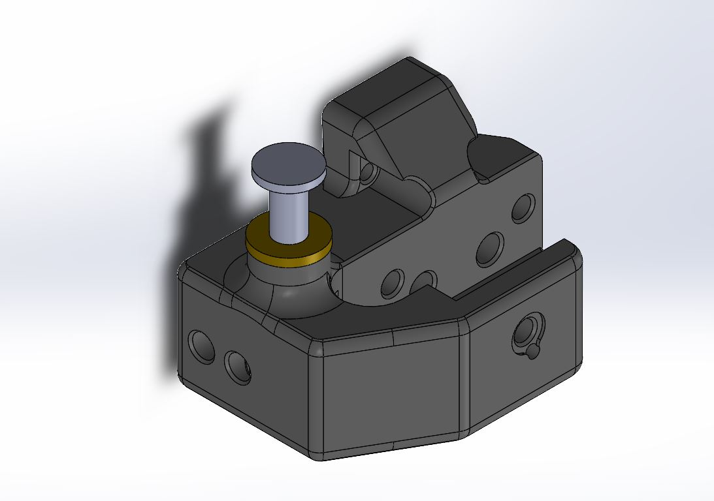

What is this?

This is a modifcation of the standard v0.1 bed mount to integrate a z-endstop that can be touched off by your nozzle.
The idea behind this was to make your z endstop offset more reliable as well as to ease z offset between multiple toolheads when using the v0.1 bed.
This part was made ideally for the Double Dragon to enable both heads to touch off the z endstop, if using it on a double dragon you have to make sure that the bed is moved such that both nozzles can reach the endstop. This results in a slight loss of bed space but it is really not noticable.

This endstop is also inspired by hart's sexbolt endstop 

The endstop also using two bushings one standard and one with a flange to account for the longer sexbolt needed to get above the bed and spring.

What you will need.
* printed part
* D2F microswitch
* 5mm x 35mm sexbolt
  *I source from amazon although the quality leaves some to be desired
* 5mm long flanged sleeve bearing for 5mm shaft
  *I sourced from mcmastercarr https://www.mcmaster.com/catalog/128/1336
* 5mm long standard sleeve bearing for 5mm shaft	
  *Also sourced from mcmastercarr https://www.mcmaster.com/catalog/128/1326/
* 2- M2 x10mm self tapping screws to mount the microswitch

Standard hardware for mounting the v0.1 bed frame mount

Assembly

Putting this endstop in place can be a bit of a challenge especially if you are looking to replace your existing bed mount. I was able to remove the bed mount without completely removing the z assembly but do this with caution. It would be best to completely disassembly and reassembly your z assembly, do this without the microswitch or sexbolt in place. Once you have the printed part installed install the head of the sexbolt, make sure the flat side is facing up. After the sex bolt is installed install the micro switch making sure that the switch is triggered by the sexbolt.
You will probably have to adjust your spring tensions to make sure there is adequete clearance for your switch to actuate, but you want the top of the sex bolt to be as close to the bed as possible to eliminate running your toolhead into in.

Make sure that your nozzle is able to reach with the sexbolt before sending a home z. The sexbolt just barely hangs over the corner of the bed.

In my experience there is some loss of bed space but it really only matters on the first few layers once you get clear there is no issue.
