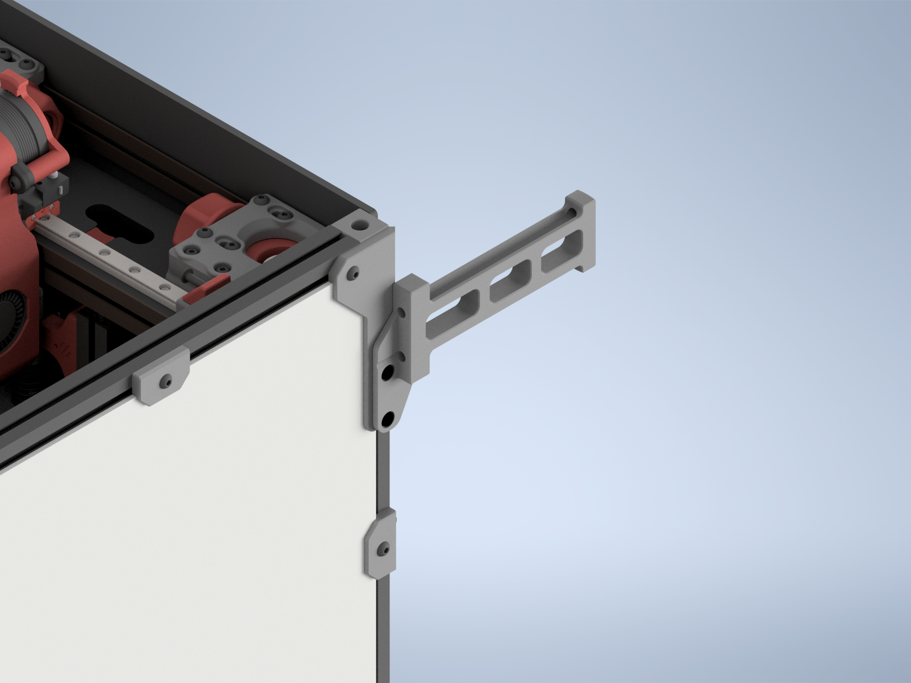
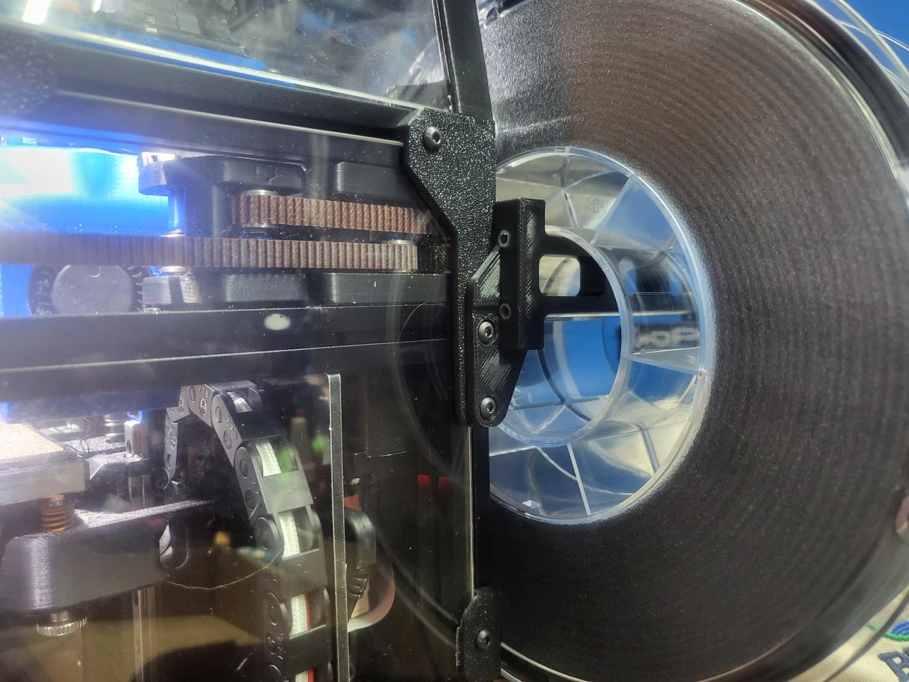
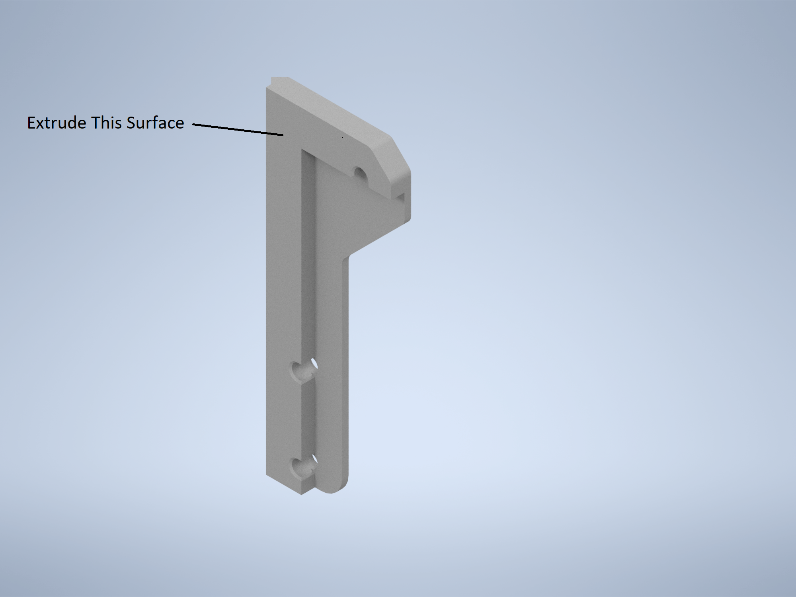

## Purpose
I originally came up with this mod in order to accommodate my custom hinged rear panel.  The stock spoolholder gets in the way of the hinging panel and won't allow it to open without removing the spool holder.  This mod moves the spoolholder to the top rear corner panel clip, allowing for easier access to the rear panel as well as providing a more secure mount.  It requires minimal hardware and is very easy to install.

## Required Hardware
1 x M3 Nut (Square, Hex, or NoDropNut, any will work)  
2 x M3x10 BHCS

## Print Settings
4 Walls, 5 Top/Bottom, 40% Infill  
Standard Voron structural part settings.  You do want this to be relatively strong.

## Install Instructions
1. Remove stock spool holder.  You can reuse the PTFE lengths.
2. Remove left side panel.  
3. Remove top rear corner panel clip from the acrylic panel.  Hopefully you used VHB instead of glue :)
4. Install the modified CornerPanel onto the side panel.  
5. Remove rear left foot and install one extra M3 dropnut (or use NoDropNuts Mod) onto the left side of the rear left extrusion.
6. Reinstall side panel.
7. Install the spool holder using the M3x10 BHCS.   One of them will replace the original M3x8 in the old panel clip.

## Notes
There are four different CornerPanel files.  Each one is sized to different panel thicknesses, like the originals.  Pick one that matches your panel thicknesses.  There is an additional 3.25mm size just because a lot of 3mm panels tend to be actually 3.15-3.25mm in my experience.  

If you find that your spoolholder is slightly skewed to one side or the other, the CAD files are supplied so you can extrude them slightly thicker or thinner to get the spoolholder to stick out perfectly straight.  If this part is too thick for your panels, the spoolholder will be skewed slightly to the left (when viewed from the back of the printer).  If it's too thin for your panels, it'll be skewed to the right.

When properly sized, the spoolholder will be perfectly straight out the back, and there's little to no chance for the edge of the spool to rub on your back panel.

