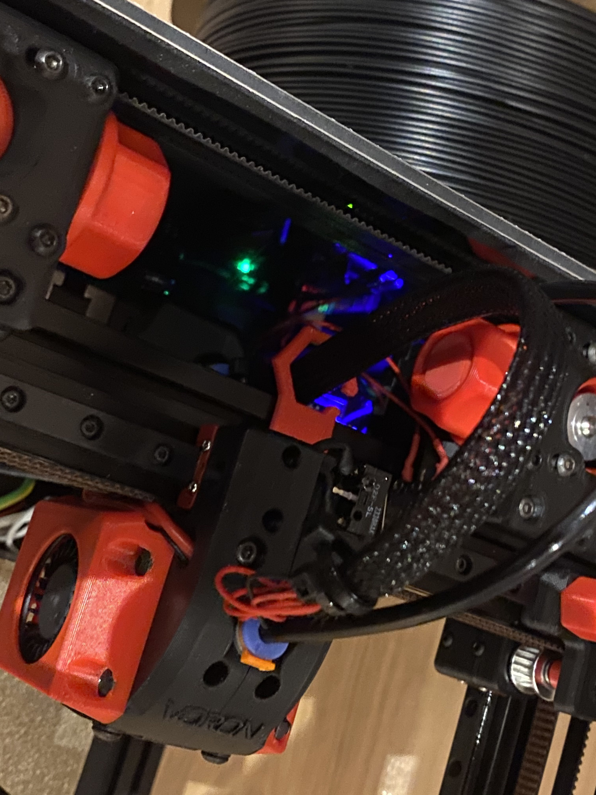

# Overview

A little "fence" to hold the tubes away from the belts. Clipmount so no further nuts in extrusions are needed.

Print one of the clips (either LDO or Makerbeam) together with the BowdenFence.stl
Don't rotate the clips, otherwise they may break upon inserting into the extrusion. They need to be orientated like in the
picture

Attach a the clip into the bowdenfence piece with a short M2 self-tapping screw.

