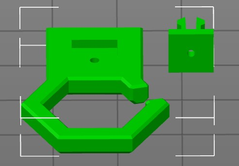
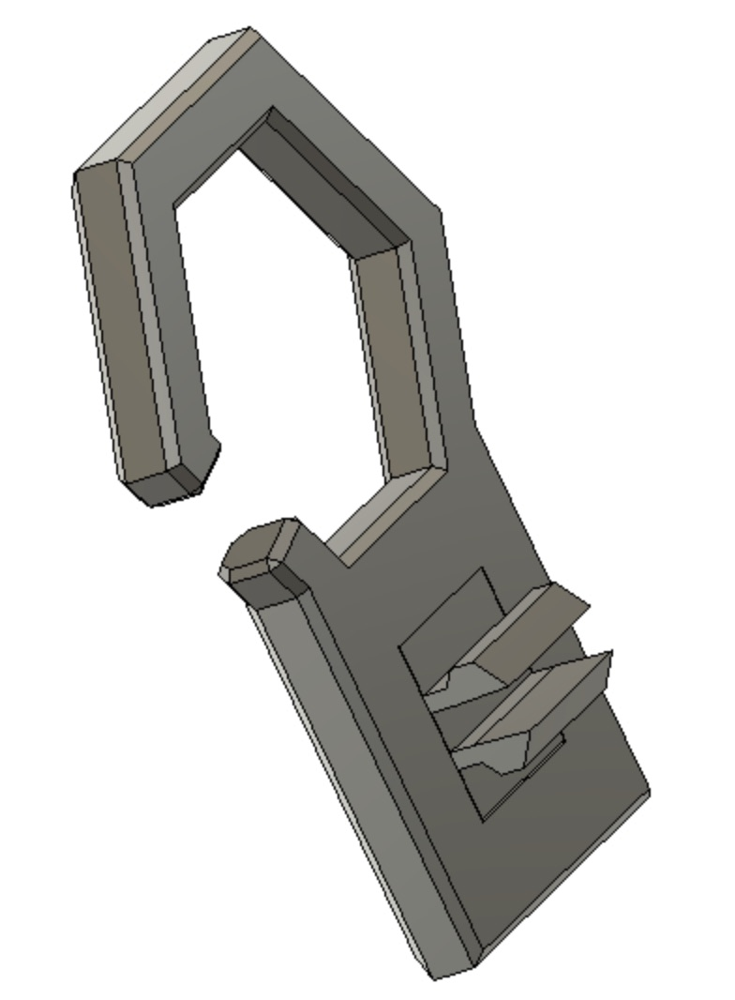

# Overview

A little "fence" to hold the tubes away from the belts. Clipmount so no further screws are needed.

Print one of the clips (either LDO or Makerbeam) together with the BowdenFence.stl
Don't rotate the clips, otherwise they may break upon inserting into the extrusion. They need to be orientated like in the
picture

Glue the clip into the bowdenfence piece and let it cure.

