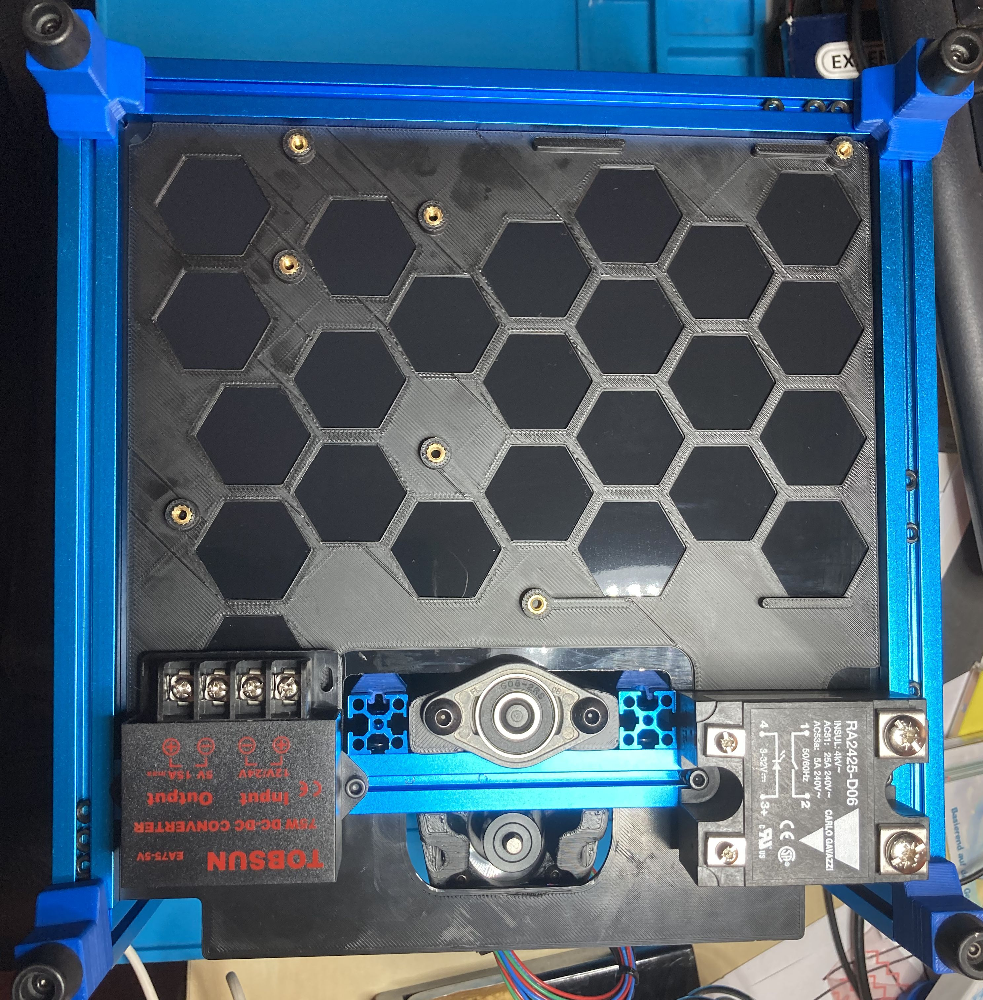

# Overview

This mod brings in a backpack for the V0 Deck Panel.

Imagine you have gotten a deck panel containing a nice print. Surely you don't want to "destroy" this nice print with holes and screws for attaching controller and PSU.

This mod is a modification of [Deck_Panel_inserts_logo](printer_mods/Kruppes/Deck_Panel_inserts_logo/Readme.md) and thus is designed for the same hardware:

* PSU: Meanwell LRS-100-24
* MCU: BTT SKR Mini E3 1.2 (tested with 2.0)

The backpack can be glued against the back of your panel. For mounting the hardware you don't need any standoffs, instead you can use the same heat inserts as for the top head or pocketwatch (M3x5x4).

Fusion 360 and Step file is included to ease your own modifications.
