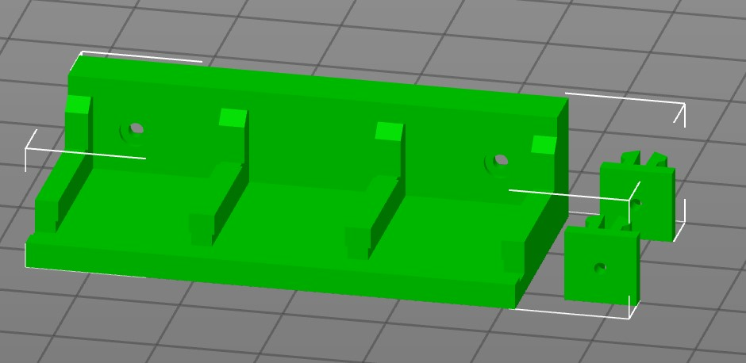

# Snap-In Wago Mounts for 1515 extrusions

## Overview

This mod is derived from [wago_221_mount](../../../legacy_printers/printer_mods/GSL12/wago_221_mount) and brings in some
mounts for the Wago 221 terminals (2 and 3 contacts) to clip and to screw for 1515 extrusions.

## Wago-Mount for screws
I use this mount [WAGO_221-413_3x3-mount-screw.stl](./WAGO_221-413_3x3-mount-screw.stl) at the power inlet to distribute the power to pad/ssr and the PSU. There is also a [WAGO_221-412_3x2-mount_screw.stl](./WAGO_221-412_3x2-mount_screw.stl), if you plan using Wago 221-412 (2 contacts).

Any m3 screw - BHCS or SHCS - should fit.

## Snap-In mounts
The snap-in mounts can be easily attached and removed from the extrusions. For using that mount print the desired stl
([WAGO_221-412_3x2-mount.stl](./WAGO_221-412_3x2-mount.stl) or [WAGO_221-412_5x2-mount.stl](./WAGO_221-412_5x2-mount.stl)
together with at least two of the mounting clips(either [LDO](./1515_SnapIn_LDO.stl) or [MakerBeam](./1515_SnapIn_Makerbeam.stl) depending on your extrusion).

Don't rotate the clips for printing. They must be printed upright, as shown in the picture. Otherwise the clips might break upon inserting into the extrusion.

Use M2 self-tapping screws to attach the clips into the appropriate places of the mount. Screw heads must be flush otherwise the WAGOs won't fit.

Both mounts fit into the Z-Extrusions of the V0:

