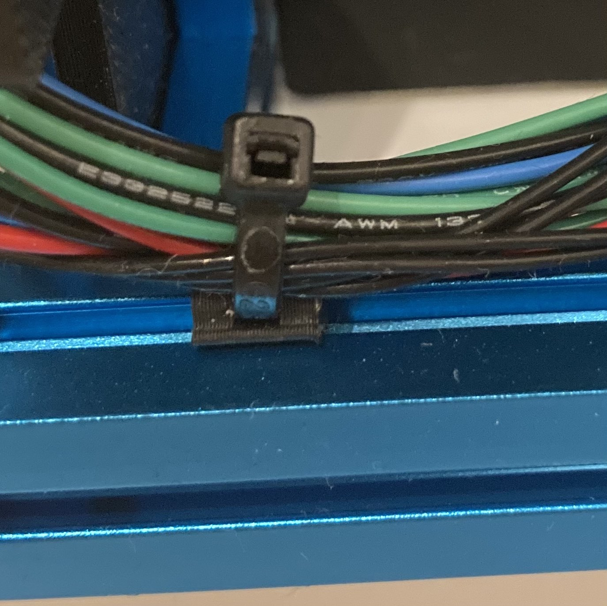
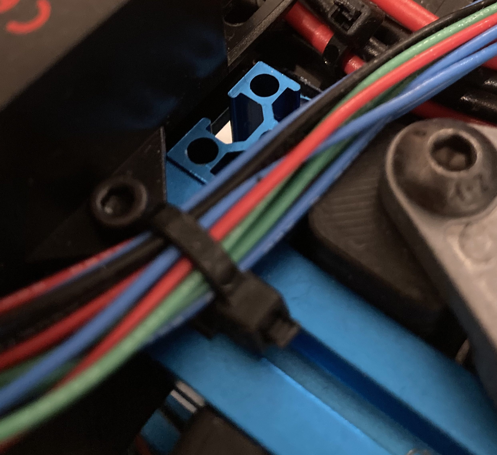
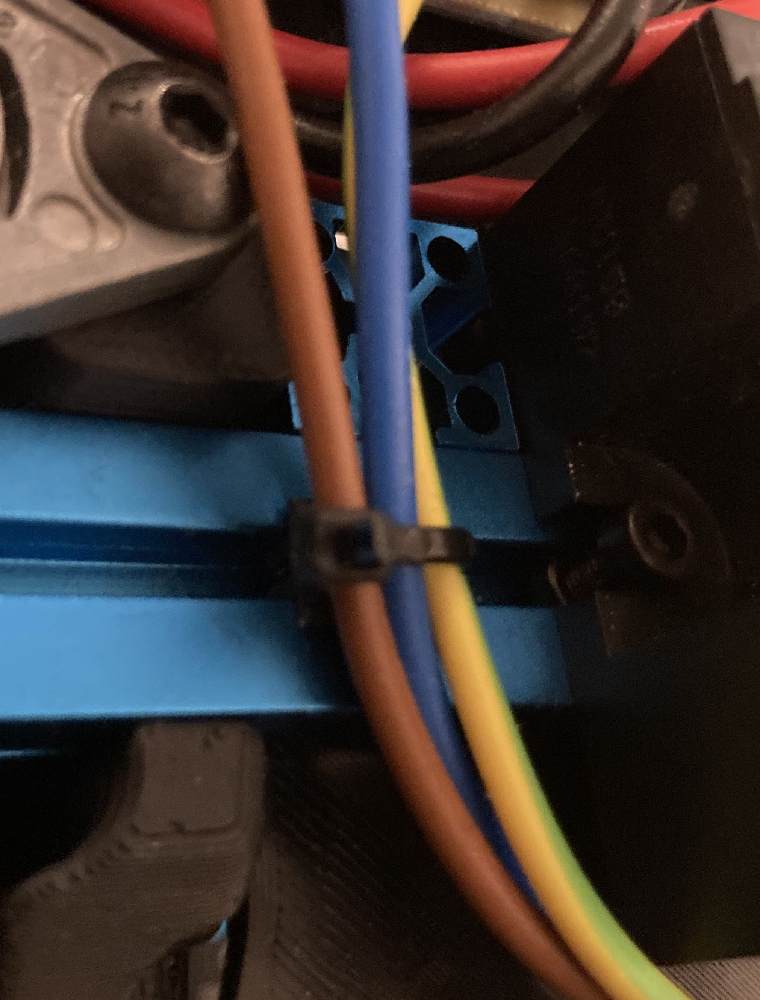

# Overview

Some clips for 1515 extrusions to attach ziptie mounts.

Comes in two flavors for LDO and Makerbeam extrusions.

Zipties can be used horizontal and vertical.

Fusion 360 and Step file is included to ease your own modifications.
