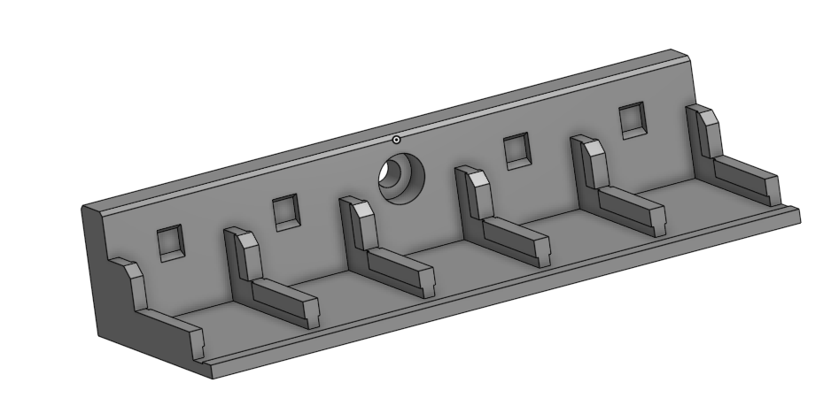
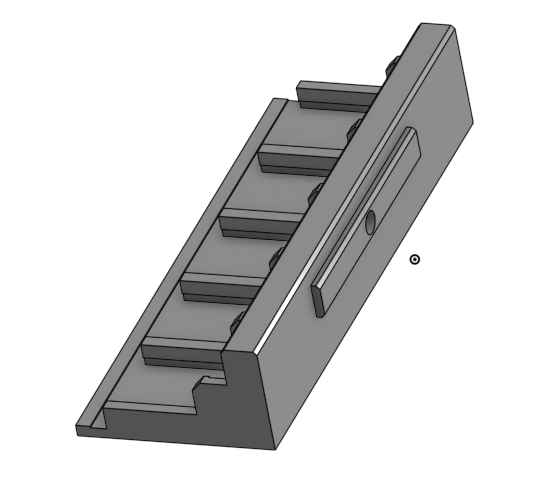

# Wago_Mounts
Wago 221 Lever Nuts are really cool, and easy to use (and not inexpensive).  The 221-412 Lever Nut can be used to make your heater bed modular.  You can get them here: https://www.amazon.com/Lever-Nuts-Compact-Splicing-Connector-Contains/dp/B093LQSQXG

There are also very nice mounting brackets for them.  The one I based mine on was created by deepfriedheroin and is available here: [V2 Bed Wagos](../../deepfriedheroin/v2_bed_wagos)

But, that mod assumes nothing else is going to be taking up that space.  I am going to also use the [purge bucket and brush mod](../../../orphaned_mods/printer_mods/edwardyeeks/Decontaminator_Purge_Bucket_%26_Nozzle_Scrubber), so I won't have enough area to take advantage of DeepFried's mount.  So I made a smaller one, that mounts flush to the same extrusion the Z-stop is on.

I also added features!  
1. It has an indexing tab on the back so it only requires one M3x8 SHCS bolt (and matching T-nut) to mount, and the indexing tab does not extend the entire length, just in case you want to push the edge past the end of the extrusion a bit for added space.
2. It has a tiny area to wedge a flathead screwdriver in to pry the WAGO out if you need to, without having to work too hard.

I printed this in PETG, but I imagine I will need to reprint in ABS once the Voron is working.  Infill doesn't really matter I don't think, but I used 70%

Note:  The live pic is an older version which works, but could be better.  It's a good location example. 

