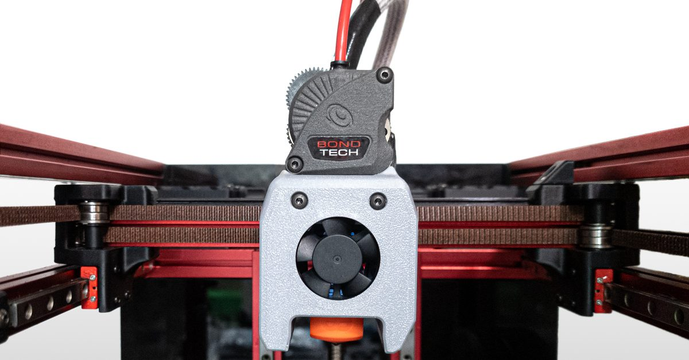
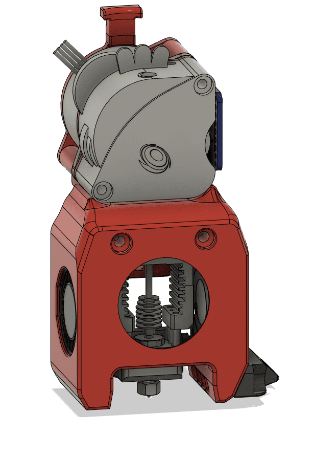
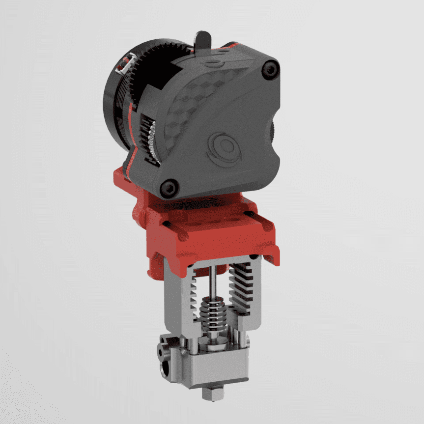
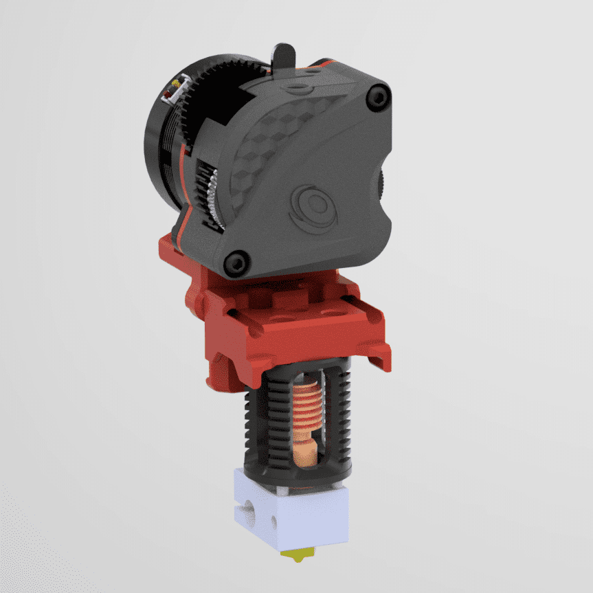
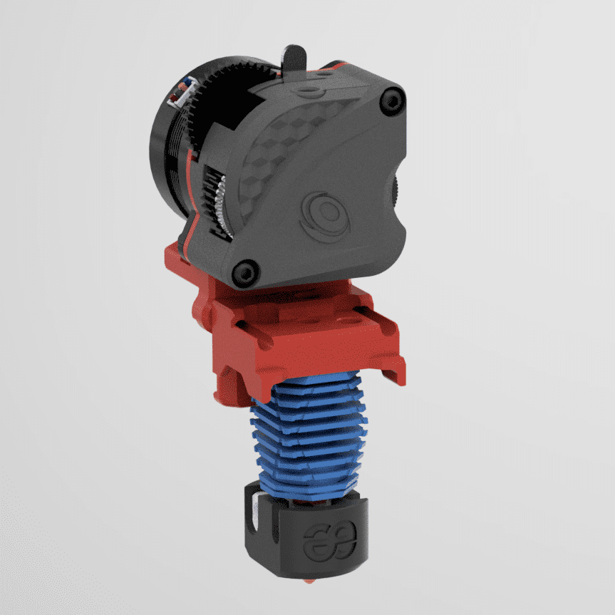
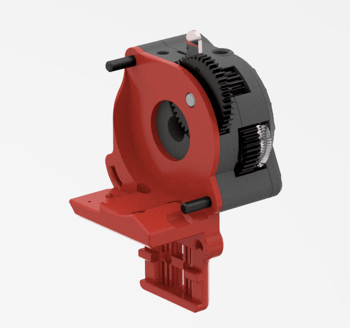
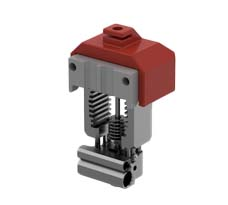

# LGX Lite Toolhead Setup For Voron V0.1

## AN ALTERNATIVE TO THE VORON ORIGINAL SETUP

### The Mini After-LGX-Lite

Designed by Olof Ogland, based on a draft design by Nemgrea.

This project also includes:

- Mounts for several hotends;
- AdaFruit and Generic ADXL345 accelerometer mounts – for Klipper’s input shaping tuning;
- Z-axis Bed Adjustable Y offset set – to allow the print bed to move back and forth from -1 up to +3.5 mm.
- Klicky – a z-probe mount that attaches with magnets

### License and Credits

License:
https://github.com/VoronDesign/Voron-0/blob/Voron0.1/LICENSE

Original source:
https://github.com/VoronDesign/Voron-0

Credits:
Nemgrea, DaveR, JosAr

Source for Klicky integration:
https://github.com/jlas1/Klicky-Probe

## Mini After-LGX-lite

Most screws required to perform the installation should be already on your kit. You may need some additional sizes and types. The following list identifies them:

- 2x M3x6 BHCS for belts
- 2x M3x30 BHCS for LGX Lite
- 4x M2.5×6 low profile for Copperhead
- 2x M3x10 BHCS LGX Lite to cowling

### Cowling Universal

### Hotend Mount MOSQUITO 3007 Fan

### Hotend Mount MOSQUITO 3010 Fan

### Hotend Mount COPPERHEAD Screw Mount 3007 Fan

### Hotend Mount COPPERHEAD Screw Mount 3010 Fan

### Hotend Mount DRAGON 3007 Fan

### Hotend Mount DRAGONFLY 3007 Fan

### Hotend Mount DRAGONFLY 3010 Fan

### X-Carriage

## Tools

### PTFE Cutting Jig

