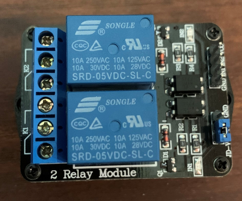
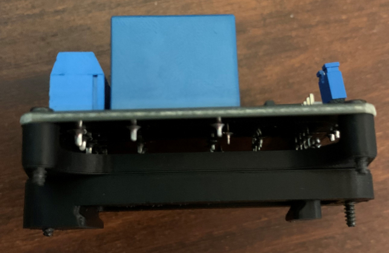

This is a DIN rail bracket for an 2-channel relay bought from [Amazon](https://www.amazon.de/-/en/gp/product/B00PIMRGN4/) 
 
May also fit for other 2-channel relays, but I have not tested. 
The spacing for the bores is: 33mm x 45mm 
 
Please use the generic PCB DIN Clip and mount this on top. 
 

