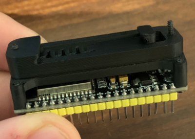

This is a DIN rail bracket for an ESP32 bought from AZ-Delivery via [Amazon](https://www.amazon.de/gp/product/B074RGW2VQ/)

May also fit for other ESP32 dev boards, but I have not tested.
The spacing for the bores is: 23mm x 51mm

Please use the generic PCB DIN Clip and mount these on top.

