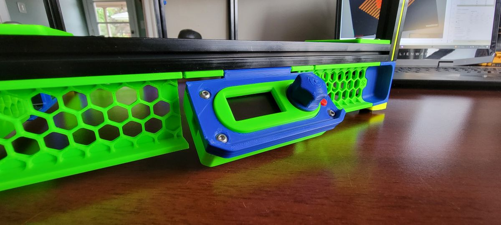

# Salad Fork Display Mount
Articulating Display Mount for Timmit99's v0 OLED Display

Designed for the Salad Fork project, Mounts to 1515 extrusions

May be compatible with other 1515 extrusion based projects

## BOM:
- (4) M3x12 BHCS
- (4) M3 Heatset Inserts
- (2) M3x6 BHCS
- (2) M3 Hex Nuts
- (1) Large Paperclip

## Assembly Instructions
1. Install Heat Sets in Back Cover
2. Slip Spacer onto the Display PCB (bridge goes along the top of the board
3. Drop Display Module with Spacer in place into Back Cover
4. Set Bezel over the encoder shaft
5. Perch Stop Button atop the microswitch (alternately you can press the button into the front and release it by pressing once fully assembled)
6. Guide Front onto the assembly, bezel will be a slip fit, make sure Stop Button lines up
7. Insert M3x12 BHCS and tighten
8. Unfold paperclip - hinge tension can be tailored with varying levels of kink in the shaft
9. Align hinge with assembly and insert paperclip into hinge slot
10. Trim paperclip to length once tension is to your liking
11. Insert hex nuts into extrusion
12. Insert M3x6 BHCS into nuts, leaving room to slip hinge slots in place
13. Slip assembly onto bolts and tighten in place
14. Enjoy your tiny display 

More info on the v0.1 OLED Display --> [Voron Hardware Repo](https://github.com/VoronDesign/Voron-Hardware/tree/master/V0_Display)

More Forky goodness --> [Salad Fork Repo](https://github.com/Yeriwyn/Salad_Fork)

Salad Fork Discussion --> [Salad Fork on Discord](https://discord.gg/RHtQhxPF)
