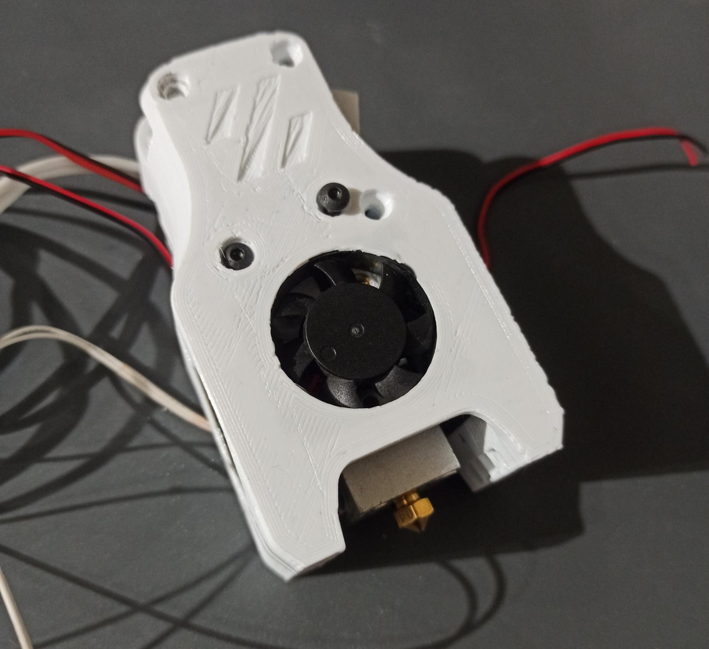
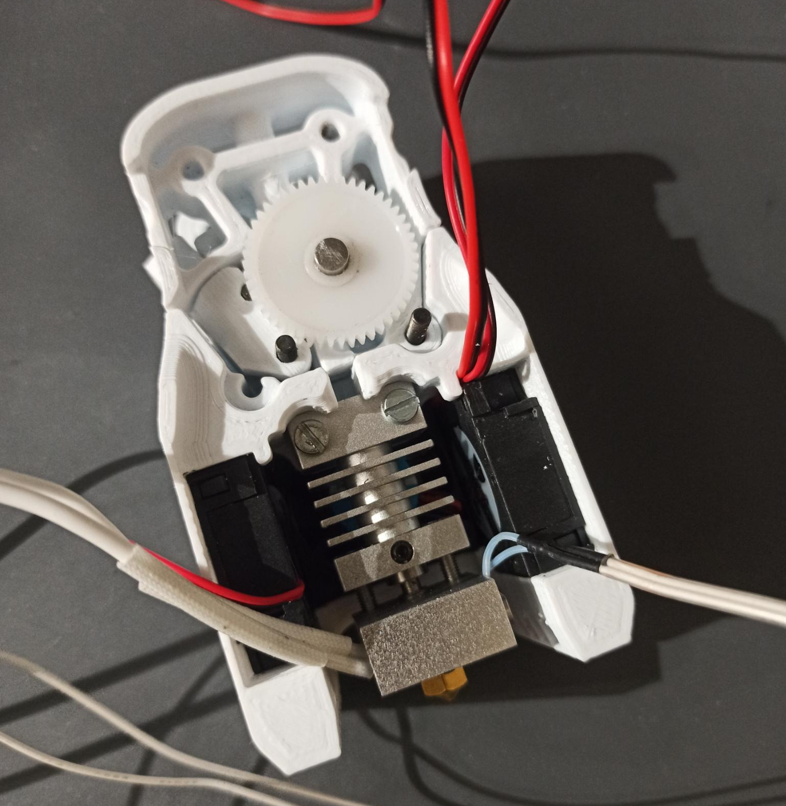

# V0.1 Ender 3/CR10 all metal hotend for the Mini Afterburner

## Description

This mod for the Voron V0.1 makes it compatible with inexpensive "all metal" hotends that are originally designed for the CR10/Ender 3 (or clones). The performance (maximum flow) may not be not as good as the hotends that were planned by the Voron team, but this part is otherwise identical/compatible with the original Mini Afterburner.

It should be compatible with any CR10/Ender 3 hotend but you should buy an "all metal" version that does not require a PTFE tube to be inserted.

## Print settings

Print the "stl/Cowling_CR10_AllMetal_builtin_support.STL" file with the settings stated in the Voron documentation:
* ABS filament
* layer hight = 0.2 mm 
* extrusion width = 0.4 mm 
* infill density = 40% 
* wall count = 4
* top/bottom layers count = 5
* no support material

Note: a version with no built-in support material is also included in this mod "stl/Cowling_CR10_AllMetal.STL". This file is not recommended and requires support material generation under the inserts lip.

## Bom

The parts required are:
* An all metal CR10 hotend like the one shown in pictures (eg: keyword for Aliexpress "ender 3 hotend all metal")
* 2 M3 Brass heatstake inserts - short M3x5x4
* 2 M3×16mm screw (any head type)
* All the parts (3D printed and hardware) required to build a normal Mini Afterburner, except the "[a]\_Cowling". Please note that concerning the "[a]\_Mid\_Body" part, you should print the **Dragon** version and add about 10mm of PTFE tube, as instructed in the manual.

## Build instructions

Remove the support material under the inserts lip.

The build instructions are basically the Voron manual. The only difference is that you need to add two heatstake inserts to be able to secure the hotend.

## Credit

Mod based on the design of the Voron design team.
Thank you for your awesome work!