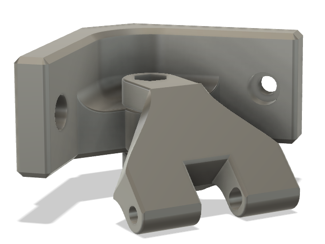

# Logitech C270 Top Corner Mount

Bracket to mount a C270 in the top corner of a V2.
This technically works with a Trident too, but I found that it put the camera too close to the gantry to get a good field of view.

The camera hinge connection is borrowed from [Fiction's mount](https://github.com/VoronDesign/VoronUsers/tree/master/printer_mods/Fiction/C270_mount).
See that readme for a description of how to mount the camera using the stock pin and screw.

## BOM

- 2x M3x8 SHCS
- 1x M3x16 SHCS
- 1x M3 Nut
- 2x M3 T-nut