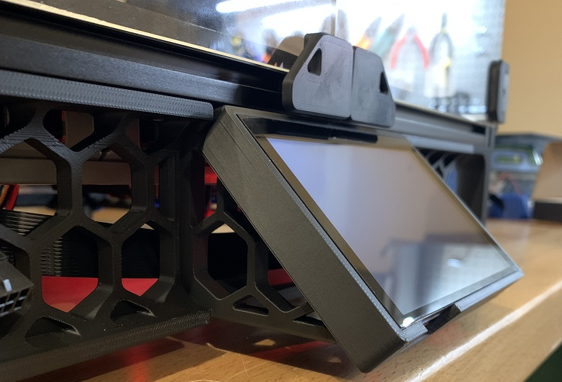

# BTT PITFT50 45-degree Mount

This mod is an alternative frame mount for [alanho's PITFT50 screen mount](../../alanho/BTT_PITFT50_v2_Mount).
They suggest using the [frame mount from sttts](../../sttts/Waveshare-5.5-inch-HDMI-AMOLED/STLs/Voron-2.4-Mount-Generisch-v6.stl),
which puts the screen at a 30-degree angle.
I found that with the shorter guitar amplifier feet on the Trident and 2.4r2,
the 30-degree mount makes the screen assembly too tall to fit under the frame.
This mod replaces the 30-degree frame mount with a 45-degree mount, which provides plenty of clearance.

This design was created from scratch, but was heavily inspired by other mods:

* [roboticator24 - 4-inch Touchscreen Mount](../../roboticator24/4inch_touchscreen_mount_for_v2.4)
* [jeoje - 4.3-inch Touchscreen Mount](../../jeoje/4.3_Inch_Touchscreen_Mount)
* [sttts - Waveshare 5.5inch HDMI AMOLED Mount](../../sttts/Waveshare-5.5-inch-HDMI-AMOLED)

This was tested with a BTT PITFT50 v2, but will likely also work with [sttts's 5.5-inch Waveshare mount](../../jeoje/4.3_Inch_Touchscreen_Mount),
since the hole pattern is the same.

## Bill of Materials
* 6x M3x8 SHCS
* 2x M3 T-Nuts
* [alanho's PITFT50 mount](../../alanho/BTT_PITFT50_v2_Mount)

## Assembly Instructions

* Assemble the screen mount
* Use 4x M3x8 SHCS to attach the frame mount to the screen mount
* Insert 2x M3 T-nuts into the bottom of the frame
* Thread 2x M3x8 SHCS into the T-nuts to attach the mount to the frame

## Printing

I printed with standard Voron settings, but this would probably be fine with fewer walls and less infill.
I found this part very prone to warping, so you may want to  use a brim or ears.