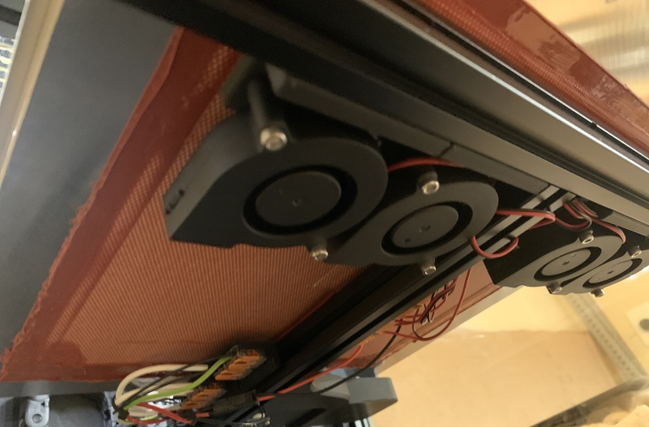

# Trident Bed Fans

[Andrew Ellis's Bed Fans](https://github.com/VoronDesign/VoronUsers/tree/master/printer_mods/Ellis/Bed_Fans),
adapted to mount on a Trident.
See his mod for some useful macros and more information.

## Bill of Materials (per fan):

* 1x 5015 Blower Fan
* 2x M3x20 SHCS
* 1x M3x8 SHCS
* 2x M3 Threaded Insert

## Install Instructions (per fan)

Note: Install the printed mount onto the extrusion before attaching the fan.
The mounting screw will be inaccessible once the fan is attached.

* Heat-set the threaded inserts into the holes in the L-shaped section
* Add one M3 T-nut to the rear-facing slot of the bed extrusion
* Use 1 M3x8 SHCS to attach the printed mount to T-nut, aligning the bump in the
  printed part with the slot on the extrusion.
* Pass 2 M3x20 SHCS through the fan mounting holes and screw into the threaded inserts
  to attach the fan to the printed mount
