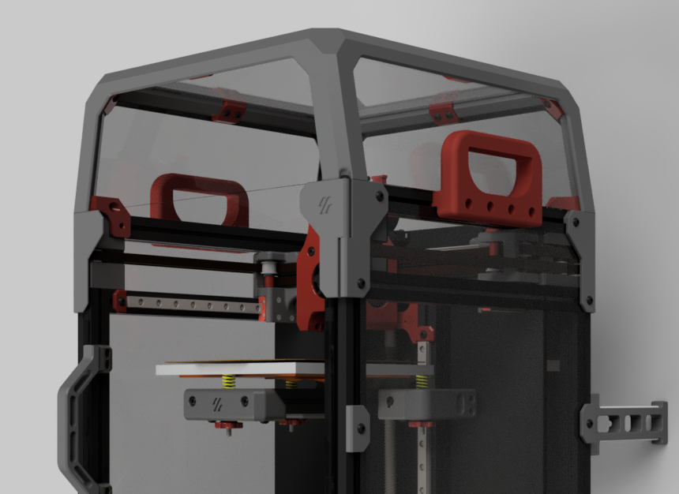
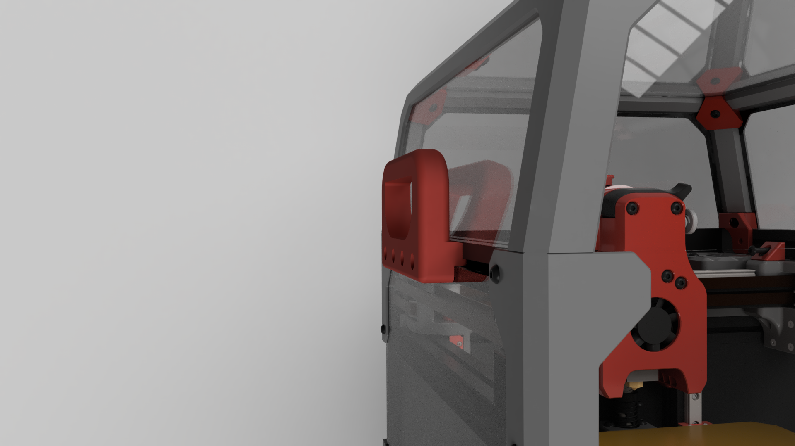
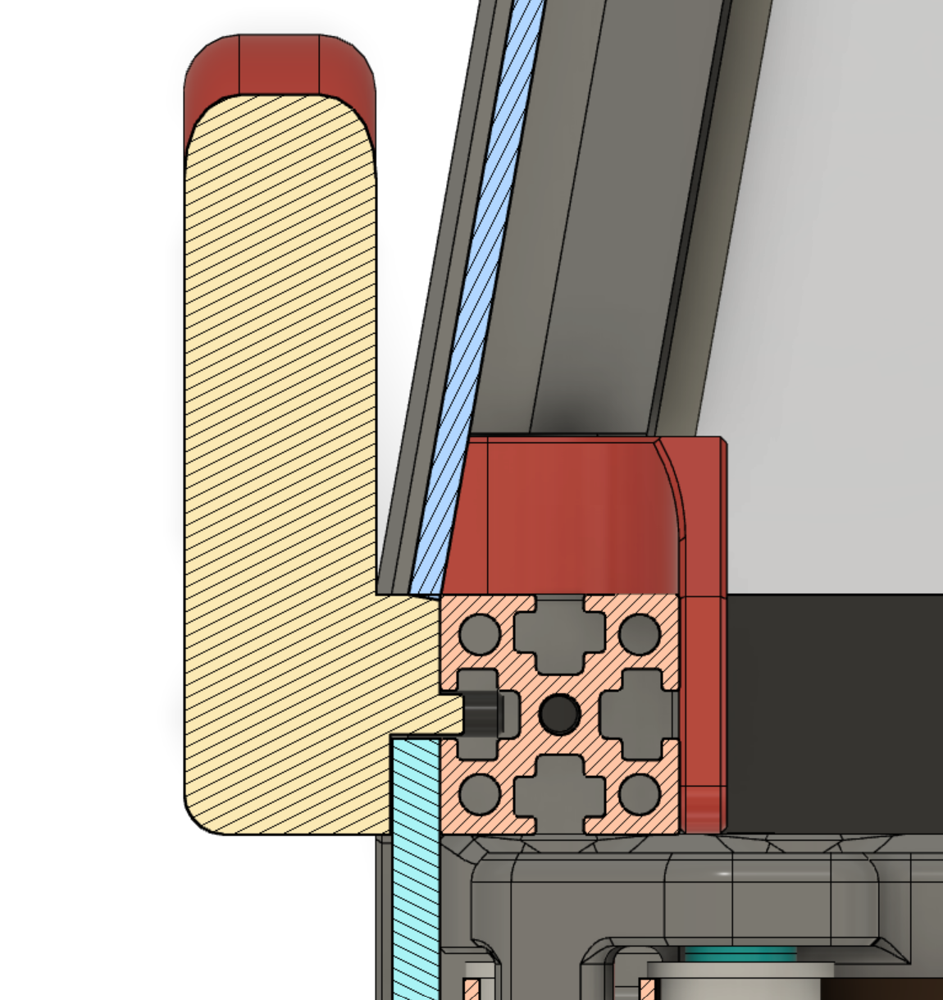

V0 Handles Slim
=========

My V0 is in my garage and my shop in the other room. Moving it back and forth for repairs was a pain as the V0.1 has no real place to grab it.

And so I made handles that don't protrude much from the sides (16mm) of the tophat keeping the footprint as close to stock as possible.

To mount:
- 4x M3x12 (8 for both sides)
- 3x M3 Nut (6 for both sides)

Print two of the file that fits your side panel thickness

- 2.5mm
- 3mm

**You will have to add 3 nuts to the top extrusions as the handle replaces the top panel clip and requires 4 nuts (3 new + 1 old from panel clip)**

1. Remove the middle clip on the top extrusions but keep the nut in place. 
2. Unscrew both screws that hold the top right and left extrusions in place. 
3. Lift the extrusions just enough to be able to add 3 nuts in the outward channels.
4. Seat the extrusions back into place and tighten the screws holding them in place. 
5. Reuse the existing nut (old panel clip) and the 3 new nuts to attach handle.

