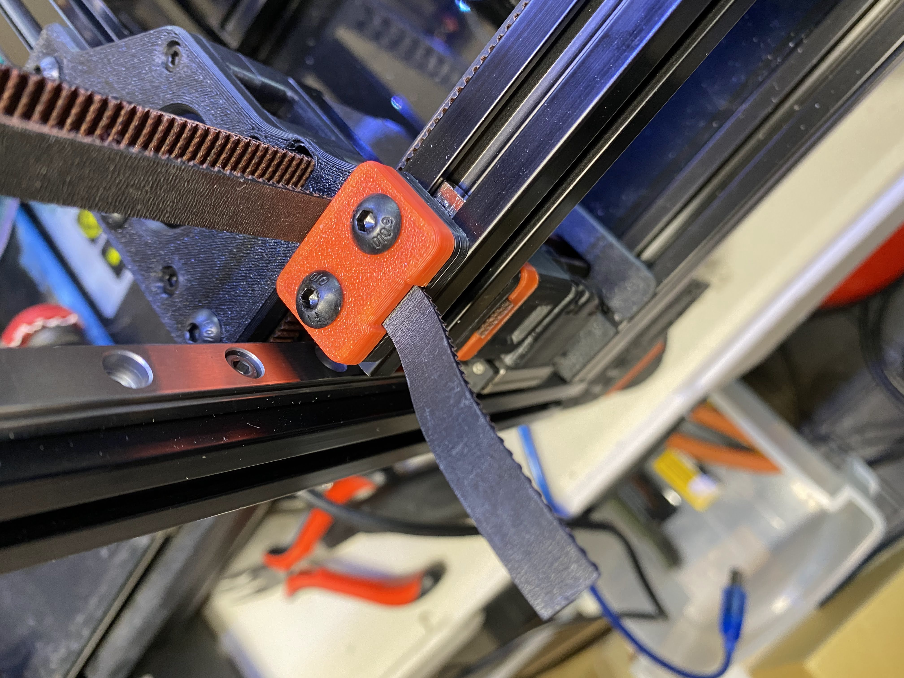
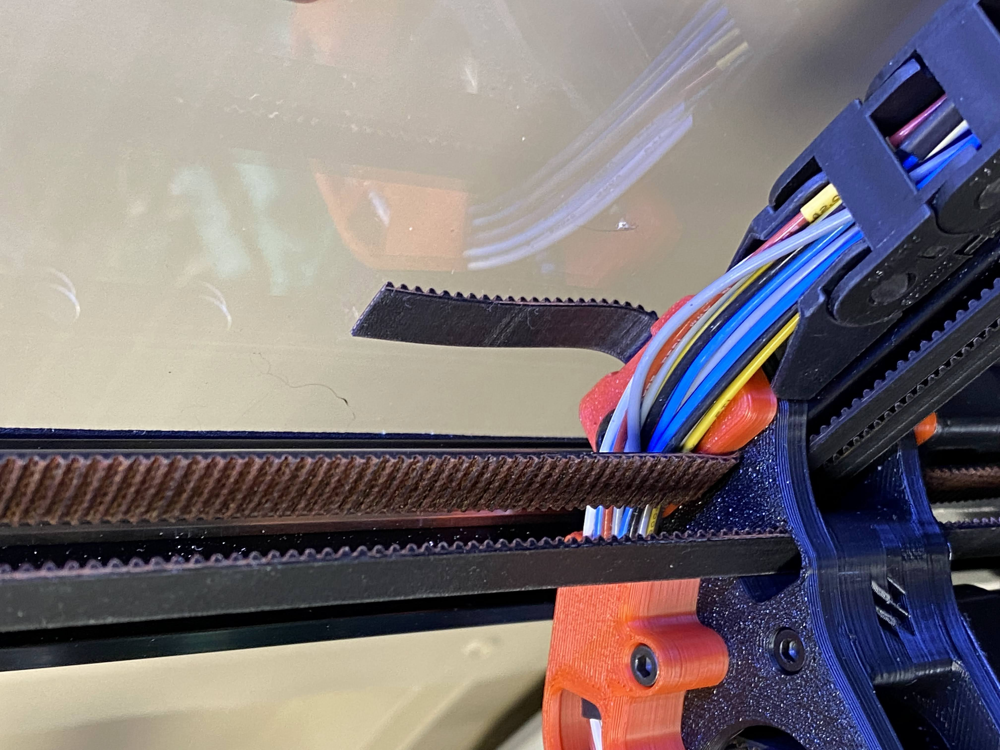
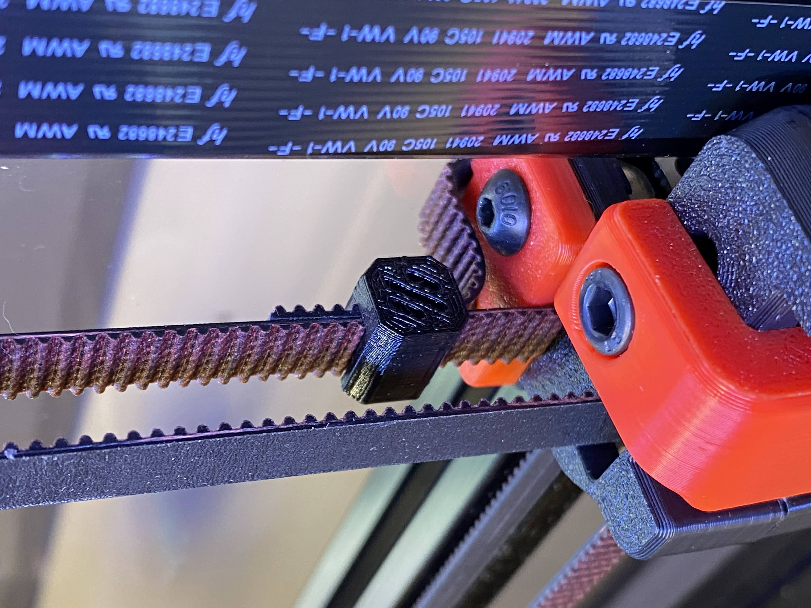

# What is this? 

## A simple Z belt clip

The 2.4 manual suggested leaving 1 to 2 inch Z belts, however, when the panels are up, the extra belt can drag along the panel. Not sure about adversary effects but not a bad idea to keep it tidy. The clip works for 9mm width belts, also should fit 6 mm. Just print and slide on.

Extra belts before panel

Extra belts with panel 

Installed Clip, all cleaned up! 

