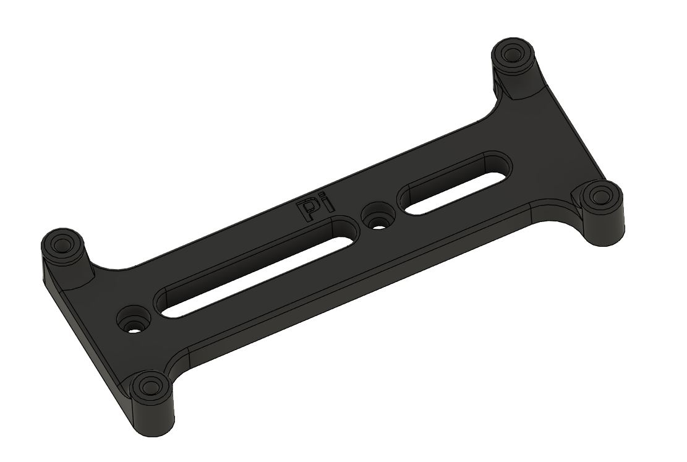

Raspberry Pi Zero Bracket

This is a modified version of the raspberrypi_bracket for the VORON Trident. Use this bracket along with a pcb_din_clip_v2 to mount a Raspberry Pi Zero to a DIN rail.

DIN Rail Install:

 The STL file for the pcb_din_clip_v2 is located on GitHub at [VoronDesign/Voron-Trident/STLs/ElectronicsBay/](https://github.com/VoronDesign/Voron-Trident/tree/main/STLs/ElectronicsBay)
  
 Use six(6):M2x10 Self-Tapping Screws to mount the bracket to the din clip and then the RPi Zero to the bracket. Note that these fasteners are included in the VORON Trident BOM.

VHB Tape Install:
 This bracket can also be installed on the VORON V0 with VHB tape in the same manner as the stock RPi bracket.

