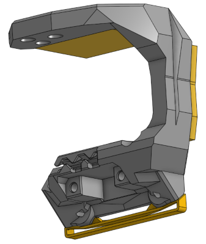
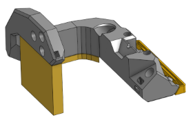
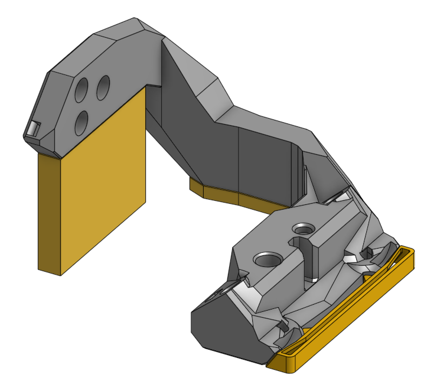
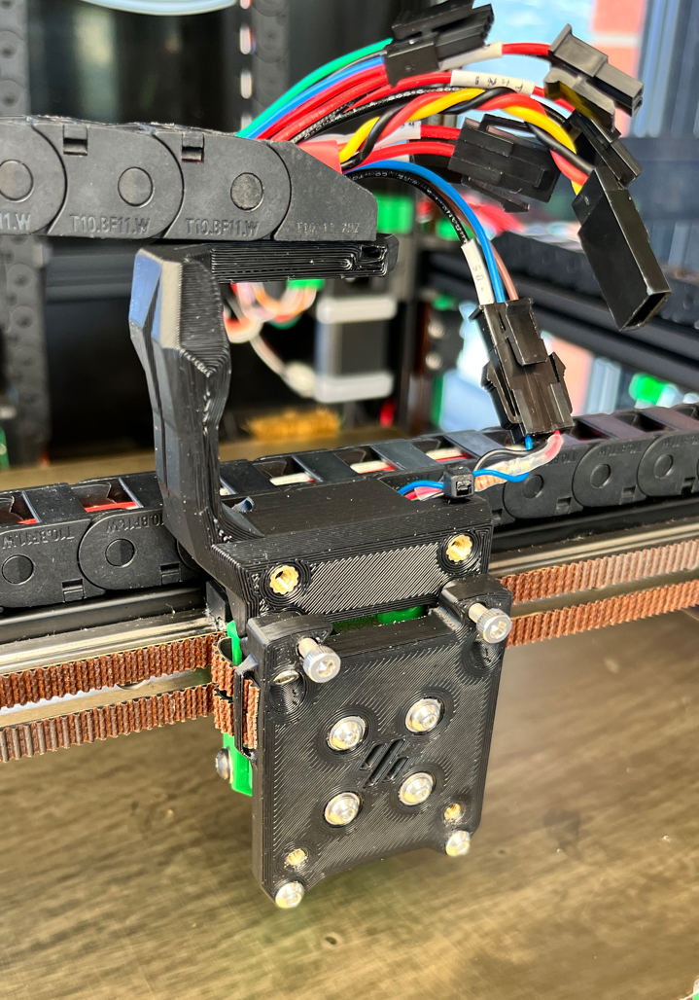
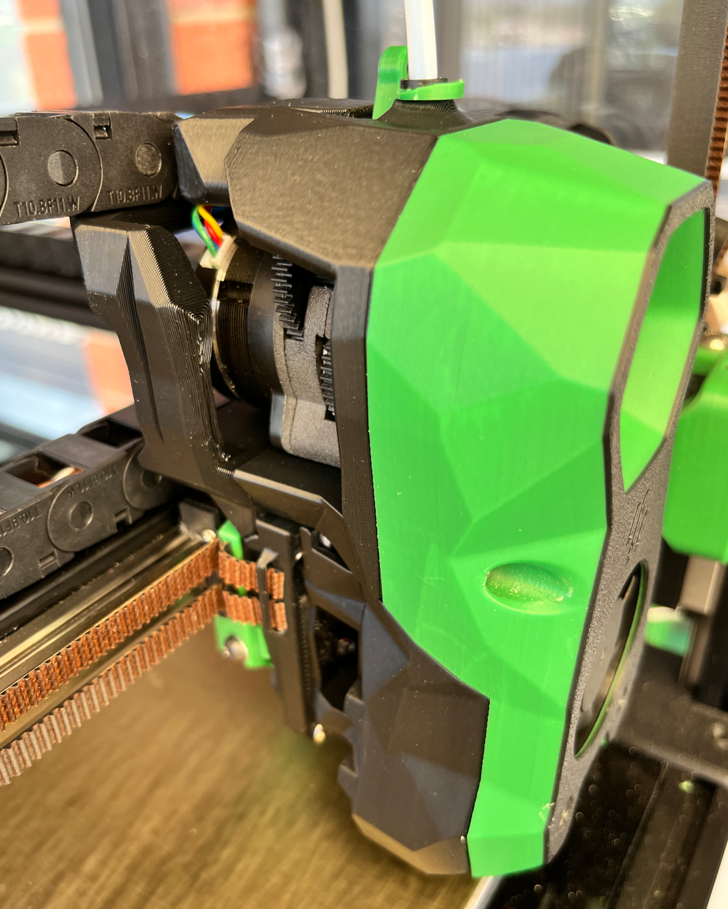

# Voron TAP TapTop Chain Anchor

##

Cable chain anchor integrated with top part of Voron TAP. 
The mount point is raised 10mm from standard position to reduce lifting force on TAP from the cable chain

 

Wired Version

PCB Version

D2HW Version 

Wired Version installed on V2.4

 

 
