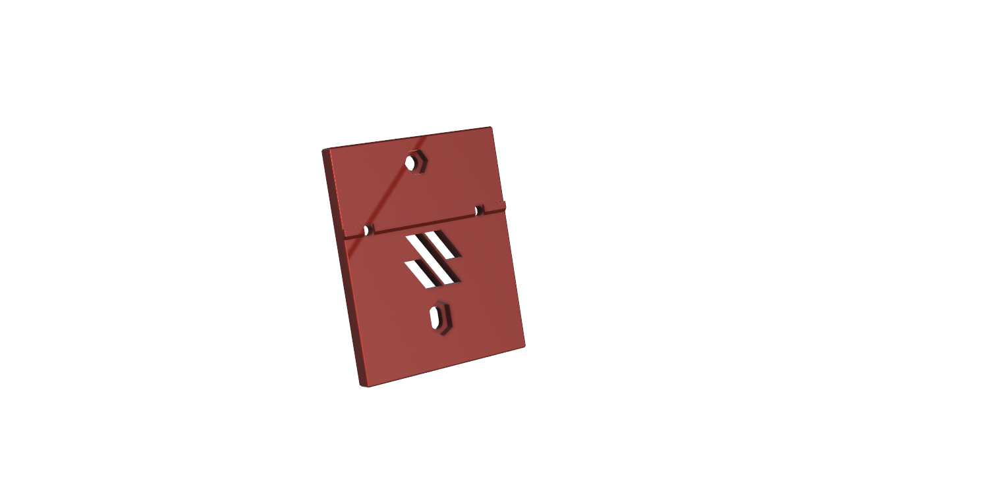
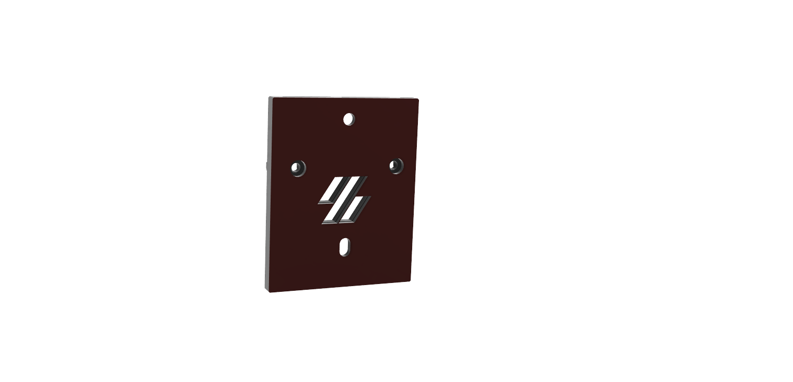
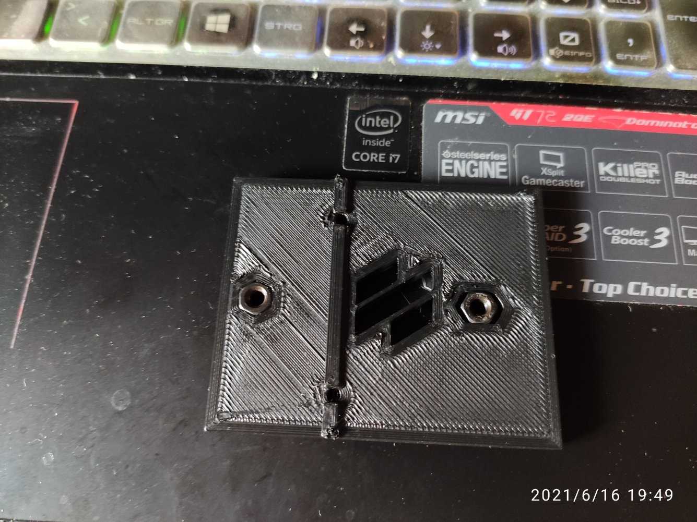
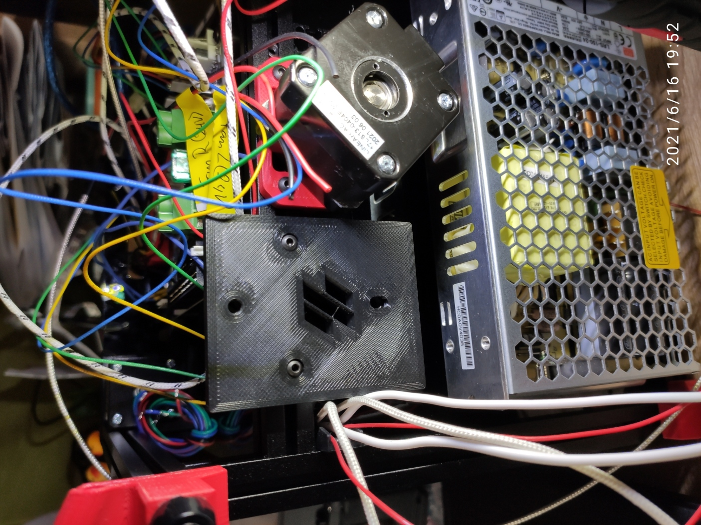
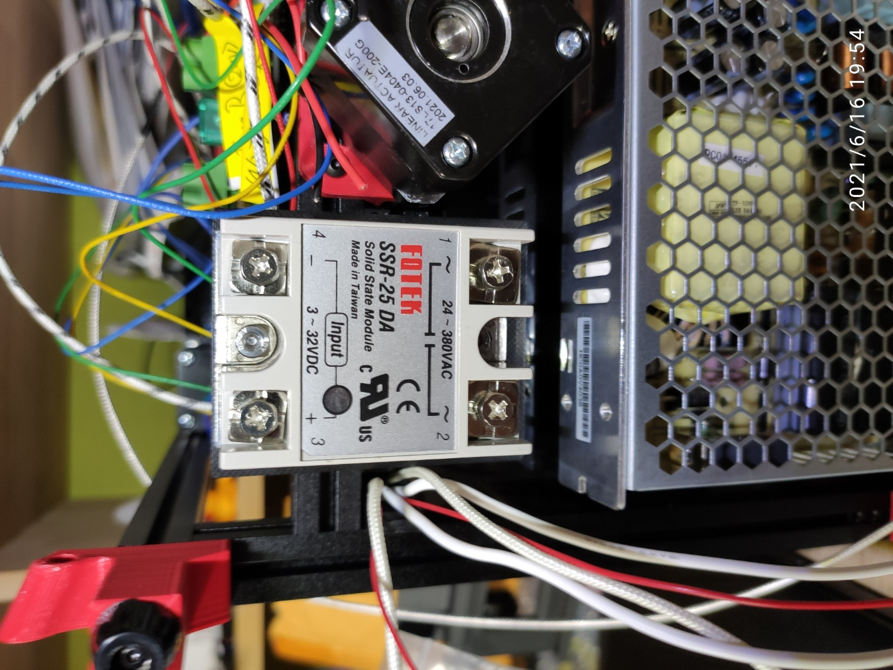

# Voron V0 SSR Mount

## BOM:

- 2 x M3x8 (to fix to the 1515 extrusion, the nuts are from the assembly instruction already available, instead of the 5V power supply)

- 2 x M4x12 (for the SSR to the bracket)

- 2 x M4 nuts

