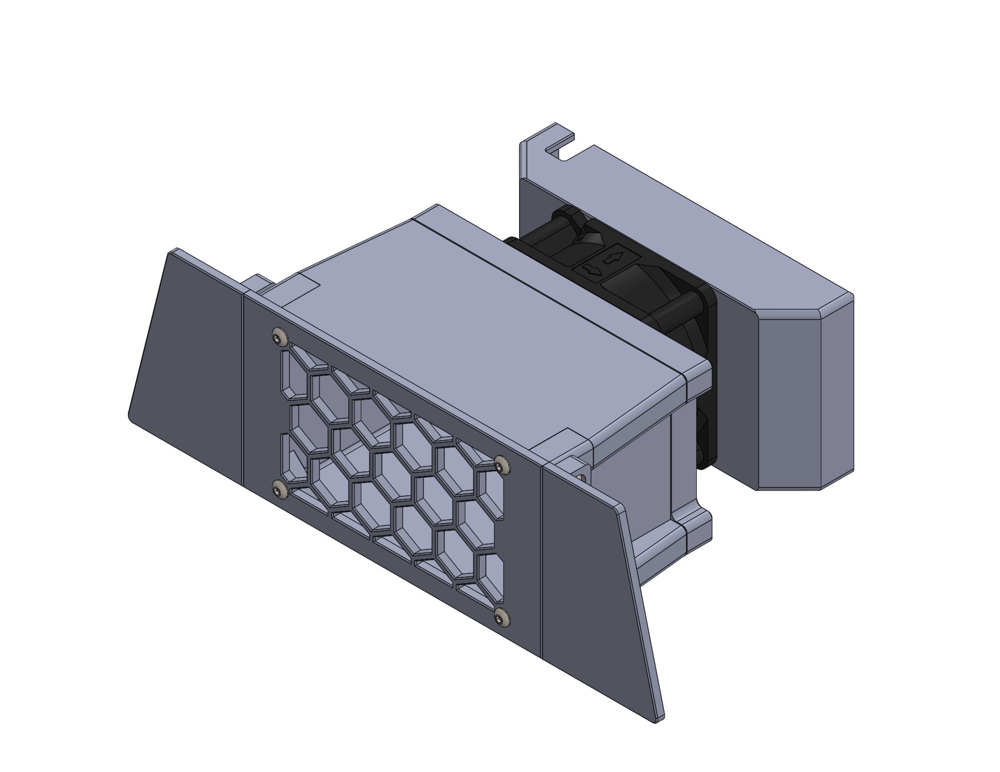
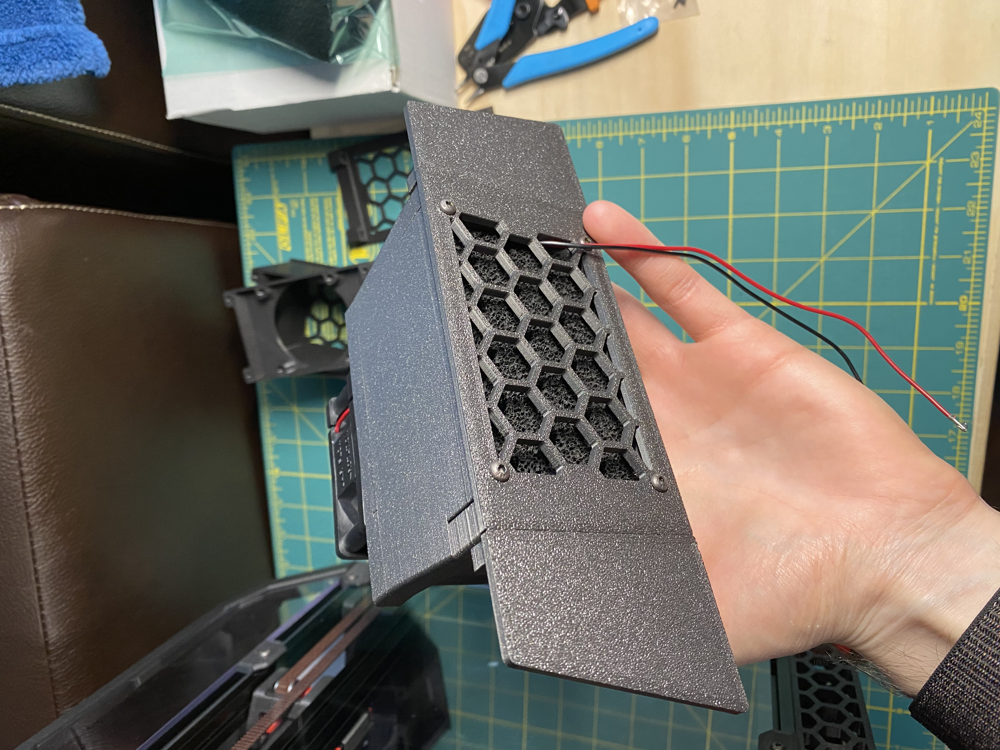
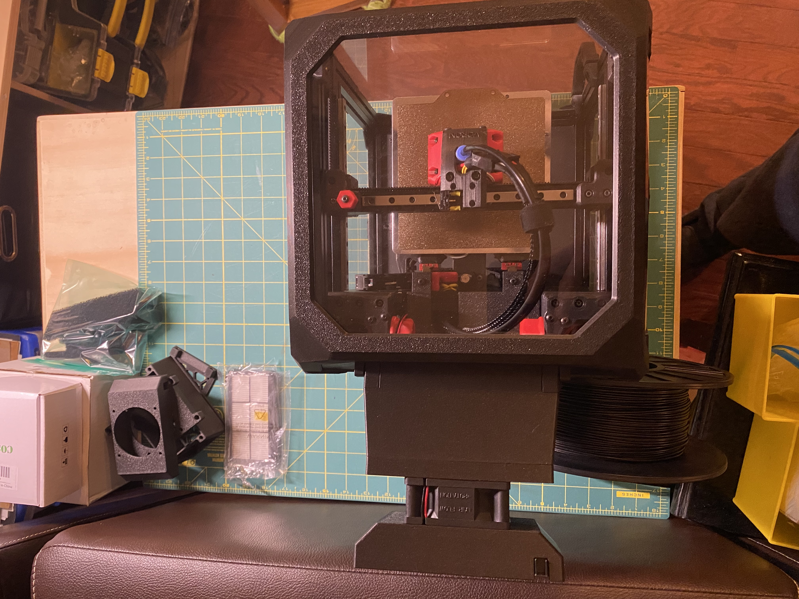
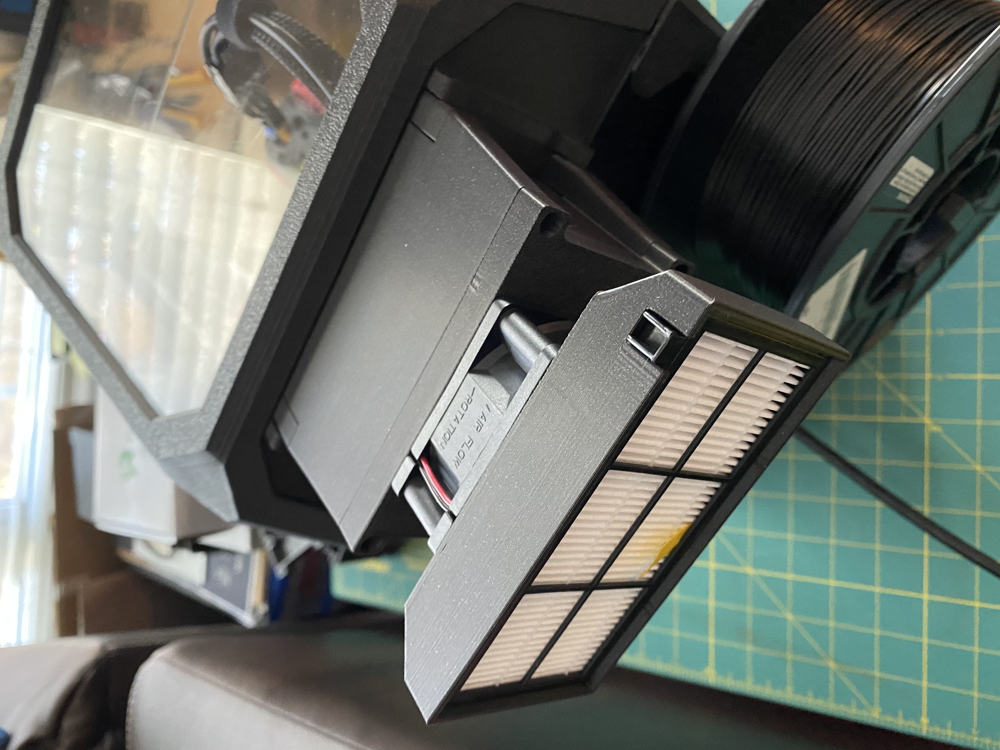
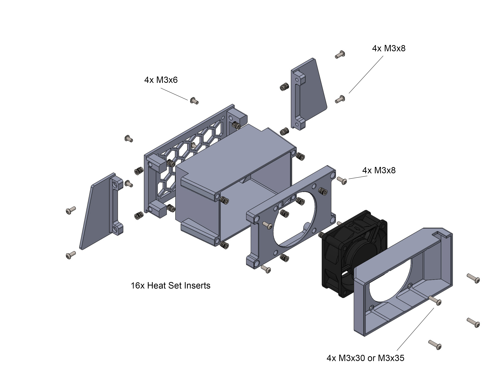
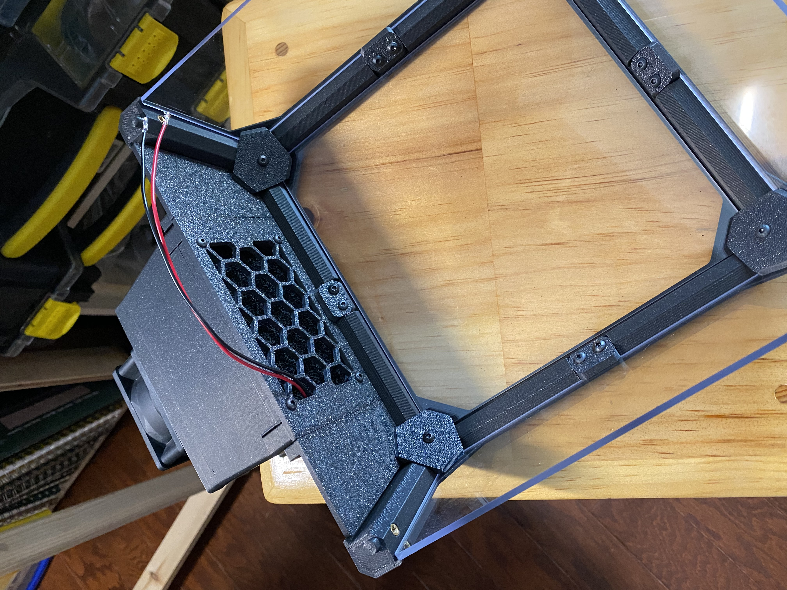

# Tophat Exhaust Filter
After growing tired of my room smelling of ABS, I decided to create an exhaust and filter system that could be printed entirely on a v0.
This mod utlizes **5 layers** of 10mm thick activated charcoal sheets, a 60mm x 25mm fan and an optional roomba HEPA filter.
I have tested it throughly and my design almost entirely eliminates the ABS smell during and after printing.




The entire assembly (With the HEPA filter attachment) sticks out about 110 mm past the rear of the printer.




## BOM
* 4x M3x6 screws
* 8x M3x6 or M3x10 screws
* 4x M3x30 or M3x35 screws
* 16x Heat set inserts
* 10mm Activated Charcoal sheets [Link](https://www.amazon.com/Xntun-Solder-Replacement-Activated-Absorber/dp/B07KWYTCG5/ref=sr_1_5?dchild=1&keywords=activated+charcoal+filter+solder&qid=1610595228&sr=8-5)
* 24v 60mm x 25mm fan [Link](https://www.amazon.com/Jamicon-JF0625B2M-005-065R-Ball-Flange-Mount/dp/B00B887J70/ref=sr_1_3?dchild=1&keywords=60x25mm+fan+24v&qid=1610595369&s=electronics&sr=1-3)
* OPTIONAL Roomba HEPA filter [Link](https://www.amazon.com/MZY-LLC-Filters-Replacement-Robotic/dp/B00K7DMEJ0/ref=sr_1_7?dchild=1&keywords=roomba+filter&qid=1610595450&s=books&sr=1-7)

## Assembly


Before printing the Fan_Cover make sure to check where the wires from your fan exit the housing and select the corresponding stl.
The fan wires snake through the assembly and exit through one of the holes in the grill. 
You will also need to cut 5 55mm x 90mm sheets of activated charcoal to fit into the chamber




## Wiring and Klipper
If you're using an SKR mini v1.2 then you must move the hotend fan from pin FAN0 to FAN1. This allows the exhaust fan to be controlled via PWM instead of the hotend fan since the 1.2 board only has 1 controlable fan port.
If you're using the v2 then you don't have to worry about that step because both fan ports are controllable.

Add this to your config assuming the exhaust fan is plugged into FAN0 (PA8)
```
[fan_generic exhaust_fan]
# Exhaust Fan
pin: PA8
max_power: 1.0
shutdown_speed: 0
kick_start_time: 0.5
```
You can then control the fan speed with
```
SET_FAN_SPEED fan=exhaust_fan SPEED="number between 0 and 1"
```
For example, to put the fan speed at 30% use,
```
SET_FAN_SPEED fan=exhaust_fan SPEED=0.3
```
Running the fan at 30% speed during a print has lead to a dramatic decrease in ABS fumes and pretty much made them unoticible.
I also run the fan at 100% speed at the end of a print to fully exhaust the print chamber.
Adding foam tape to seal up any gaps between panels and the tophat will also greatly increase the reduction of fumes.
