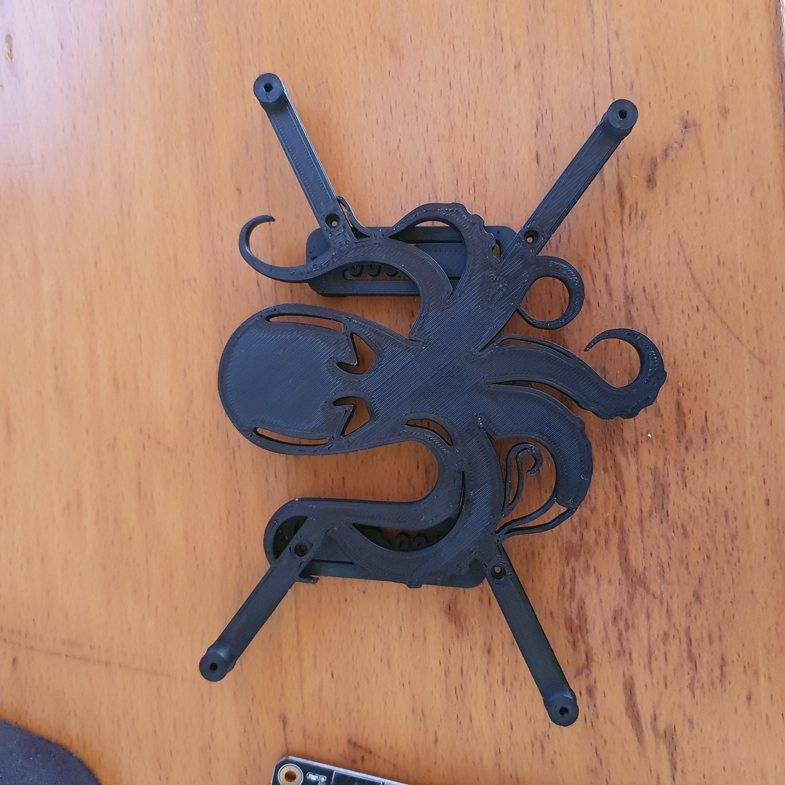
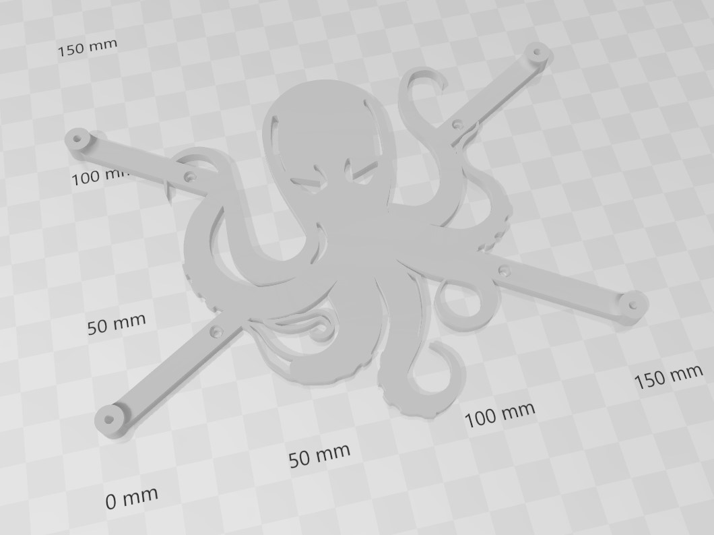
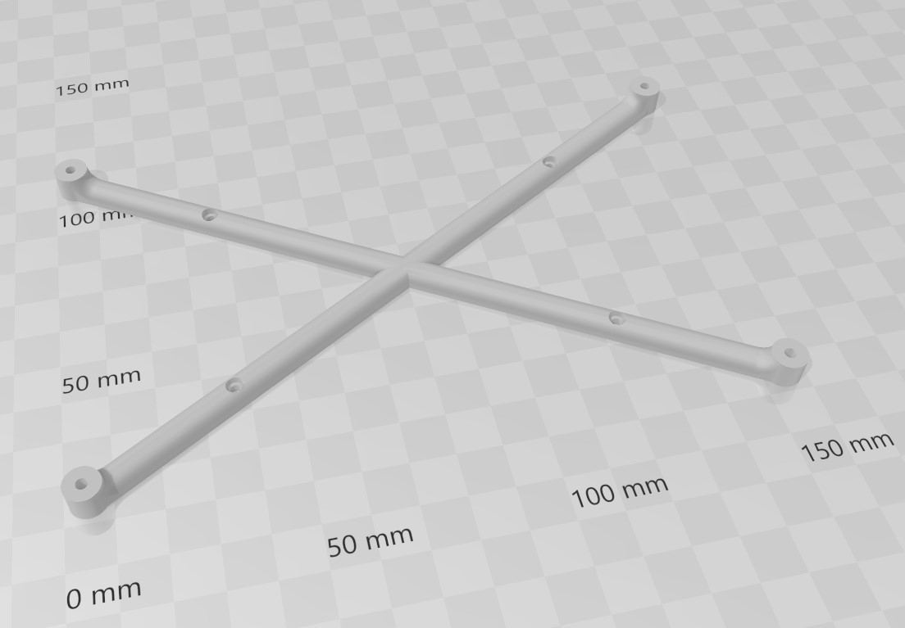

# Just another DIN Rail bracket for BTT Octopus board

This is an alternative DIN Rail bracket for Bigtreetech Octopus boards (Normal and Pro-HV), posted this way back in Voron Discord just never uploaded it to VoronUser Mods

Use either 2 of the old style Voron 2.4(r1)  [r1_pcb_din_clips](https://github.com/VoronDesign/Voron-2/blob/V2.4r1/STLs/VORON2.4/Electronics_Compartment/DIN_Brackets/pcb_din_clip_x3.stl).
or 2of the new trident/r2 ones [r2_pcb_din_clips](https://github.com/VoronDesign/Voron-2/blob/Voron2.4/STLs/Electronics_Bay/pcb_din_clip_x3.stl).

Octopus board can be secured to those bracket with M3 screw, without nuts, just gently screw them in as its ah just plastic fitting!

I've also made ah simple Version of the bracket, initially even before the octopus limbs Version, as there where no bracketavailable as i got my Octopus board...

There are also the SVG Files of the Octopus Logo i created, from what i used to extrude the Bracket in Fusion360

#### STL:
[Octopus limb bracket STL](./STL/Octopus_limbs_bracket.stl)

[Simple bracket STL](./STL/Simple_Octopus_Bracket_v2.stl)

