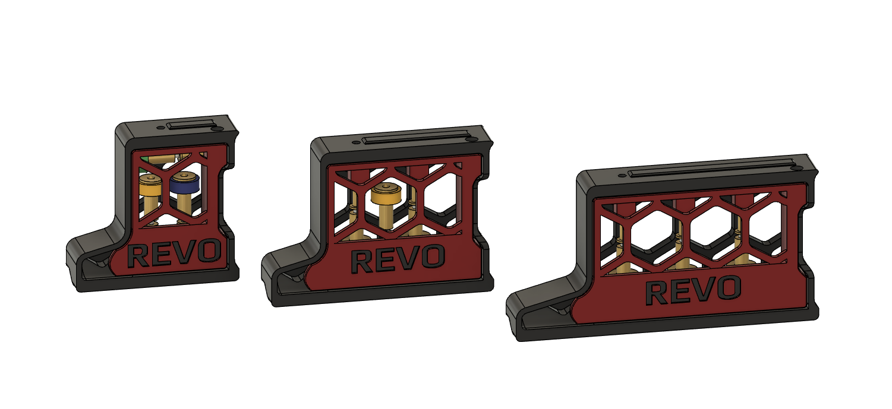

## Voron Revo skirt mod

This is a modified skirt that lets you house the 3 current revo voron nozzles whilst they are not in use.  Currently only designed for the 350,  300 is possible, 250 is  small but I think I found a way to squeeze them all in

Designed for the Voron 2.4 R1 and R2

Hardware Required: 2 M3x8 or M3x10 SHCS.  

They thread into the plastic and should be somewhat tight to keep the door closed, A design with a magnet may be in the works.

The Nozzles can either be left free floating,  Or you can thread them into the top blocks if you do not want them rattling about.

A big shout out to So I says... [V0.420|VT.634] on the discord as he created the trident versions which gave me the drive to make these!

