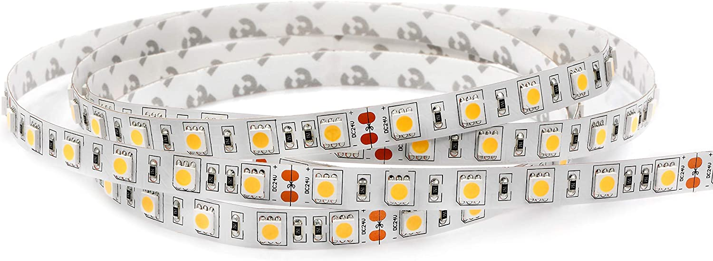
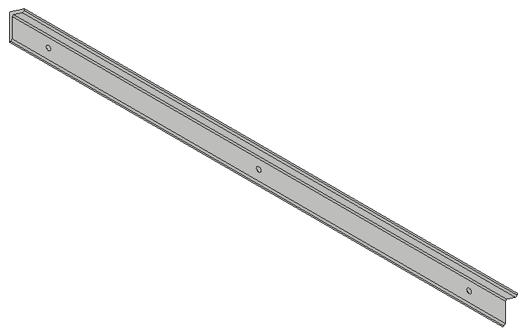
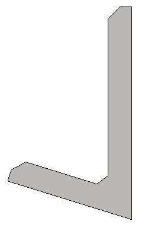
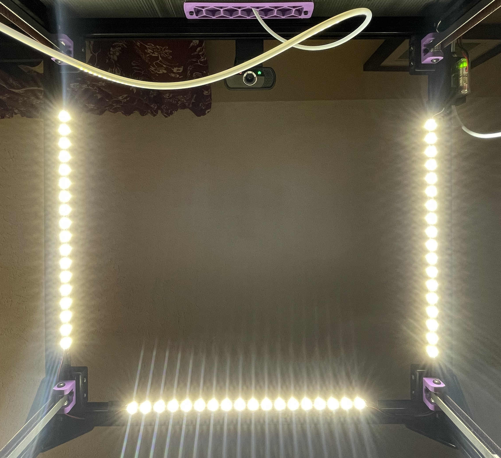

# LED Strip Holder

Works on Trident & 2.4 any size.

This mod lets you mount LED strips inside your printer. I mounted three in mine and it is like daylight inside the box.

I used [these 24V strips](https://www.amazon.com/gp/product/B00XH59VG4) from Amazon and connected them to a fan output on my Octopus board. Works a treat.

You can mount as many "strips" in your printer as you like. I have one on the front rail and one on each side for a total of three. You can cut the strip at the solder obrounds and connect them with wire to go around the corners. I run the wire in the extrusion down to the controller and use an extrusion cover to hold the wires in.

 

