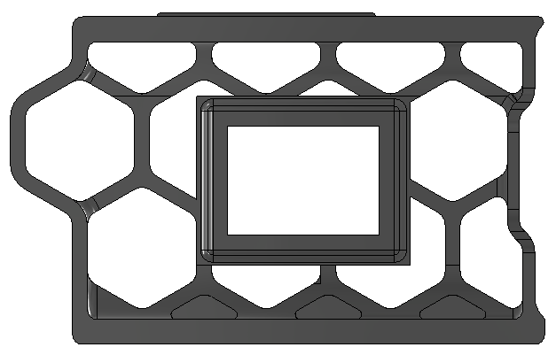
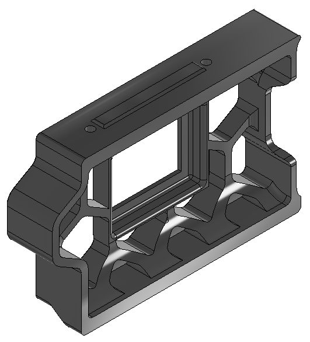
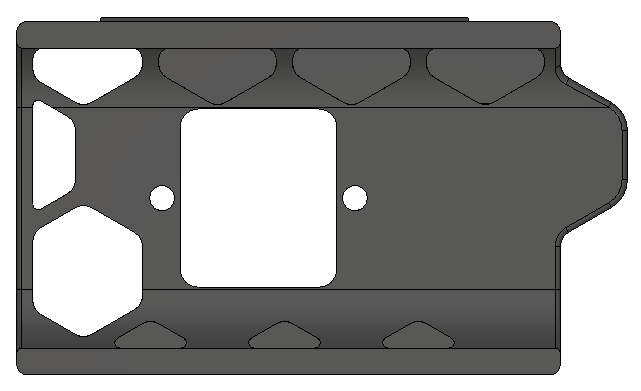
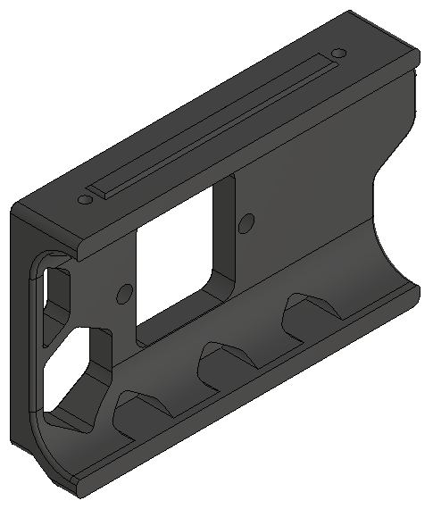

# Trident Right Skirt Switch

This mod moves the power switch to the right side front panel of the skirt. I've only made the skirt for the 300mm version... if you want a different size, let me know and I'll model it.

There's also a new filtered main skirt to print with this that removes the power switch. This skirt will work on all Trident sizes.

Remixed to fit the Trident from this [tayto-gp Voron 2.4 Skirt mod](../../tayto-chip/skirt_switch_mod)

