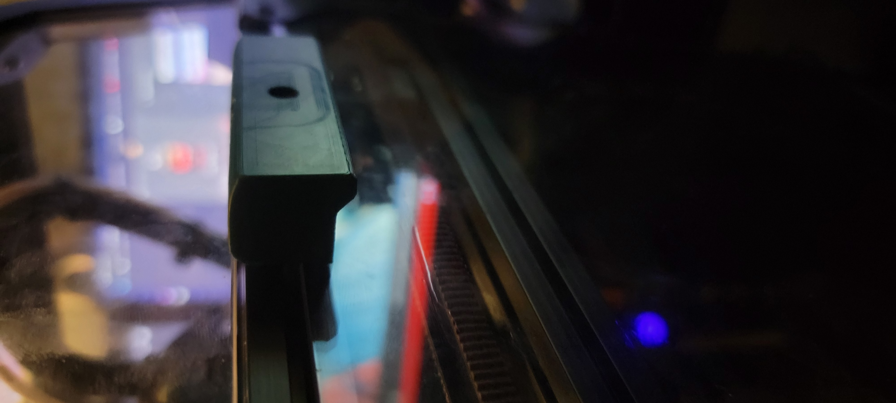
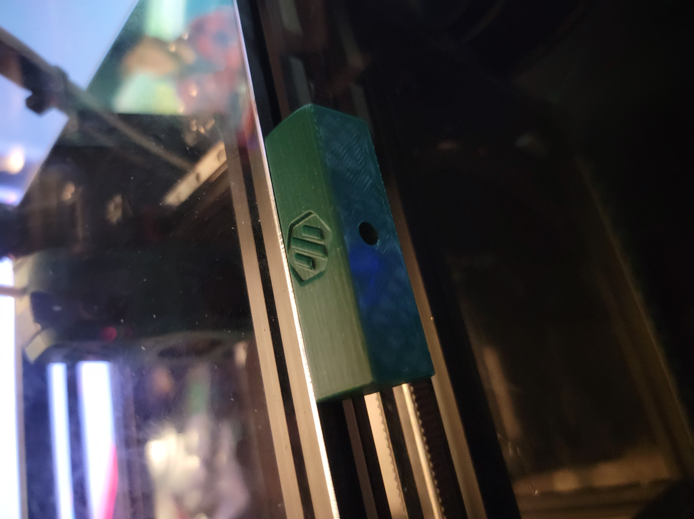

This is a simple handle design that replaces both side top most panel mount clips.
The idea was to make a handle that doesnt require nuts to be added to the frame of the v0.1. Uses a single M3x12.

