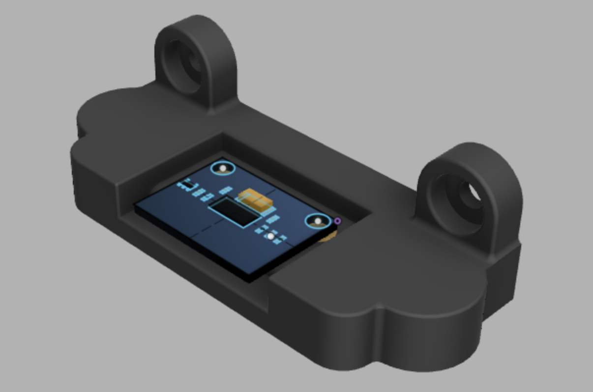

# Input shaper mount for Afterburner

This mode replaces the front middle skirt in order to mount a 3.5in touchscreen display for Klipperscreen. It has two printed parts: the main body and the front plate. Threaded inserts go into the main body and the M3x8 screws are used to mount the front plate onto the main body.

## BOM

- 2 Threaded inserts (stock)
- 2 M3x16 BHCS or SHCS
- 2 M3x6 BHCS
- 2 round magnets 8x4
- Input Shaper [ADXL345](https://www.amazon.com/gp/product/B07DMZCGP9/ref=ppx_yo_dt_b_search_asin_title?ie=UTF8&psc=1)

