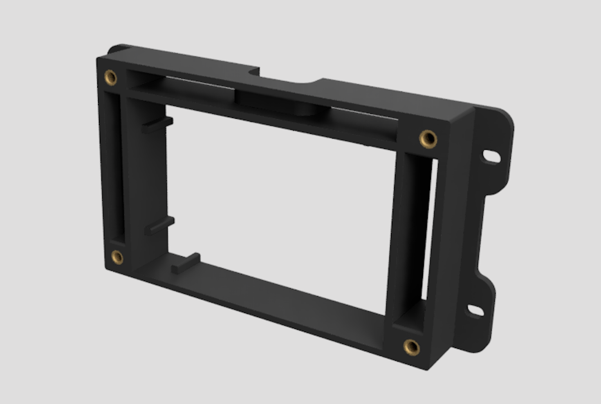
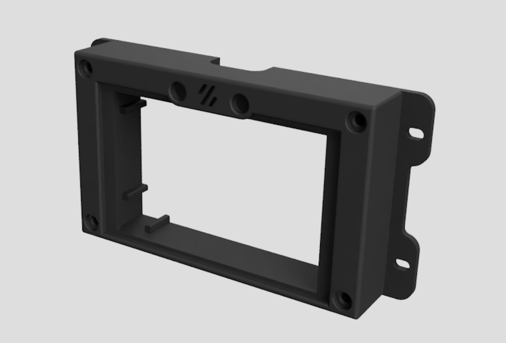

# 3.5in TFT Display Front Skirt - Switchwire

This mode replaces the front middle skirt in order to mount a 3.5in touchscreen display for Klipperscreen. It has two printed parts: the main body and the front plate. Threaded inserts go into the main body and the M3x8 screws are used to mount the front plate onto the main body.





This is a remix of the original display mount by `rcfishhunt`.

## BOM

- 5 threaded inserts (stock)
- 4 M3x8 BHCS
- [3.5in TFT Display](https://www.amazon.com/gp/product/B07KLDKM5D/ref=ppx_yo_dt_b_search_asin_title?ie=UTF8&psc=1)

## Software


### Klipperscreen

Follow this [tutorial](https://github.com/jordanruthe/KlipperScreen/blob/master/docs/Installation.md) to install Klipperscreen on your Raspberry Pi.

### LCD Show

Ssh into your Raspberry Pi and execute the following commands

```
sudo rm -rf LCD-show
git clone https://github.com/Lcdwiki/LCD-show.git
hmod -R 755 LCD-show
cd LCD-show
sudo ./MHS35-show
```
