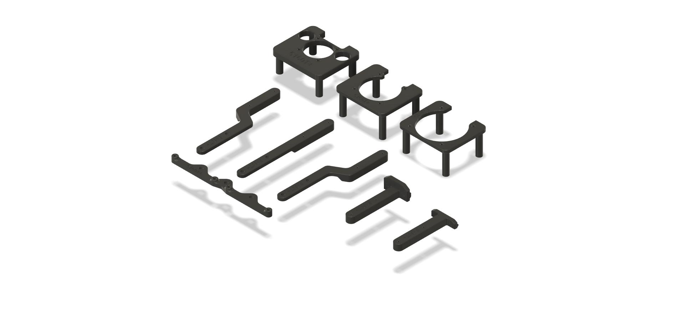
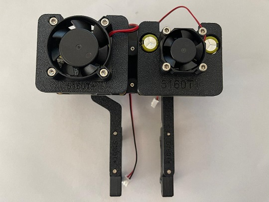
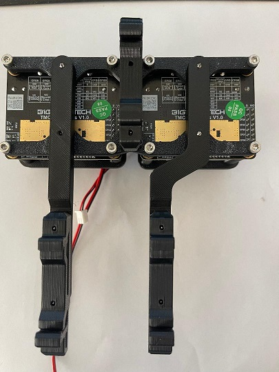

# TMC mounts for BTT 5160T Plus

A single mount will hold a pair of 5160T Plus. Each mount is designed for direct mount to a DIN rail or use a combination of the brackets to mount to 2020 extrusion, 1515 extrusion or offset the mount near your MCU. The offset mounts for the MCU include a left, right and center to allow the user to get the ideal position.

### Printing
  * Print 1 mount per pair BTT 5160T Plus
  * Print 2 [Voron PCB DIN Clip](https://github.com/VoronDesign/Voron-2/blob/Voron2.4/STLs/Electronics_Bay/pcb_din_clip_x3.stl) (Not needed for 2020 bracket)
  * Print 2 brackets per mount (optional)
  * Default Voron settings
  * No supports needed

### BOM
**per TMC Mount**
Item | Size | Qty | Comment 
--- | --- | --- | ---
Self Tapping Screw | M2x10 | 4 | Direct DIN Mount
Self Tapping Screw | M2x10 | 8 | DIN Mount with brackets
SHCS/BHCS | M3x8 | 4 | 2020 bracket to 2020
T-Nut | M3-2020 | 4 | 2020 bracket to 2020

# Fan Duct Mounts for BTT 5160T Plus

Mounts for 30mm, 40mm and 50mm fans. FYI 30mm fan mount is the lowest profile.

### Printing
  * Print 2 fan mounts per BTT 5160T Plus Mount
  * Default Voron settings
  * No supports needed

### BOM
**per Fan Mount**
Item | Size | Qty | Comment
--- | --- | --- | ---
SHCS/BHCS | M3x12 (max 16) | 4 | Secure fan mount and TMC to TMC mount
SHCS/BHCS | M3x12 (max 16) | 4 | 3010, 4010 or 5010

