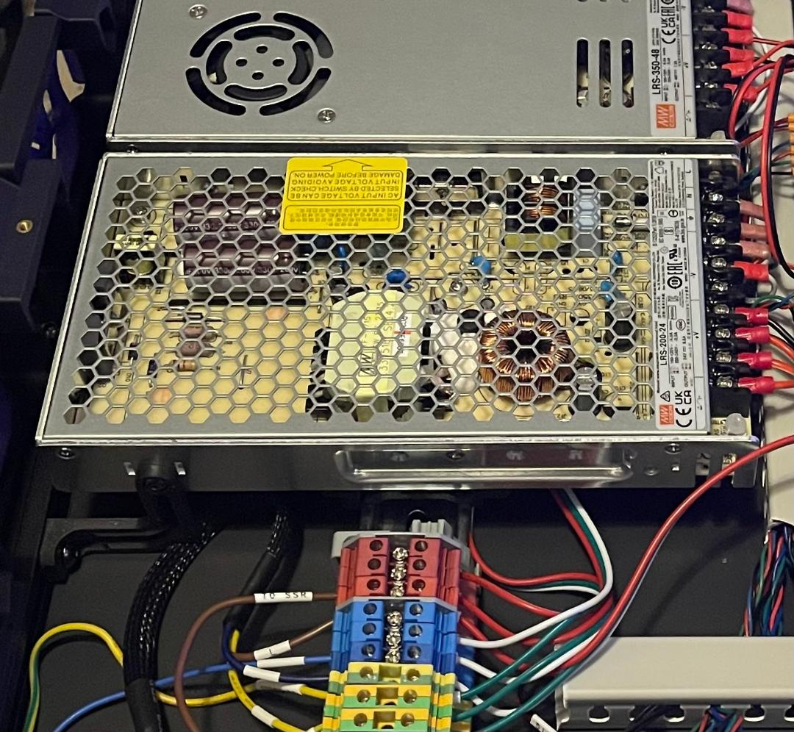

# LRS Offset Mount and Stabilizer

This allows you to offset the LRS PSU to add an additional LRS PSU to the same DIN.
### Printing
  * Print 1 set of offset mounts per LRS PSU
  * Print 2 [Voron PCB DIN Clip](https://github.com/VoronDesign/Voron-2/blob/Voron2.4/STLs/Electronics_Bay/pcb_din_clip_x3.stl) per PSU
  * Print 1 PSU stabilizer per PSU
  * Default Voron settings
  * No supports needed

Note:
 * VT - use any length range
 * V2.4
    * 250mm - suggest use 35mm to 55mm or 35mm to 95mm
    * 300mm - suggesr use 50mm to 70mm or 35mm to 95mm
    * 350mm - suggest use 75mm to 95mm or 35mm to 95mm

### BOM
**per LRS Offset and Stabilizer**
Item | Size | Qty | Comment 
--- | --- | --- | ---
Self Tapping Screw | M2x10 | 4 | DIN Mount with LRS Offset
BHCS | M5x10 | 1 | PSU Stabilizer
BHCS | M4x6 | 5 | 4x-LRS Offset and 1x-PSU Stabilizer
T-Nut | M5-2020 | 1 | PSU Stabilizer

