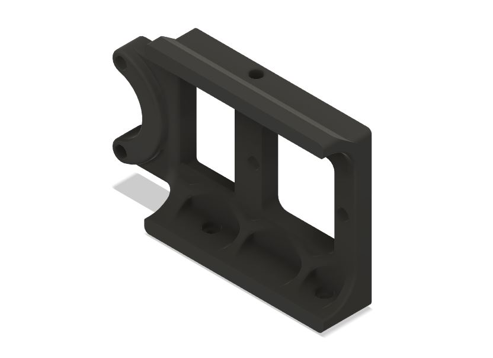
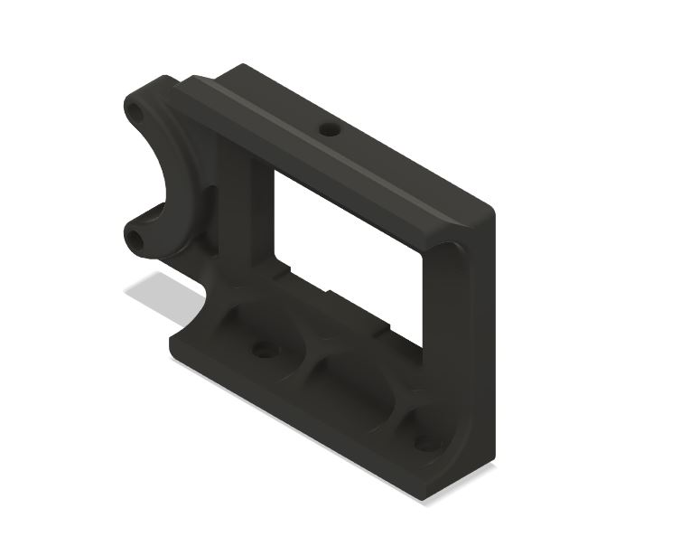
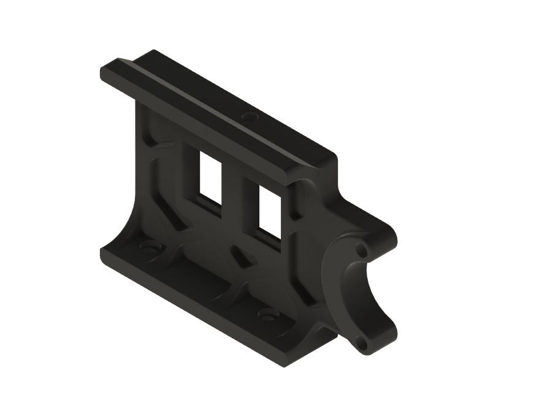

# V2.4 Rear Skirt Mod for Z-Drive Motor Tensioner Mod

Credit for the Mod goes to Edward Yeeks for the orginal design and Skohls for updating the mod for the R2 changes.
https://github.com/VoronDesign/VoronUsers/tree/master/orphaned_mods/printer_mods/edwardyeeks/V2.4_z_drive_motor_tensioner_mod

This mod enables the you to utilize the rear skirts, power and keystone, in your V2.4R2 while still being able to use the Motor Tensioner Mod.
***NOTE: heat set insert holes are in a new location so you will have to reposition your bottom panel clips and hinges.***

### Printing
  * Default voron settings
  * No supports needed
  
### BOM
Same hardware for mounting skirts for Voron V2.4r2.

