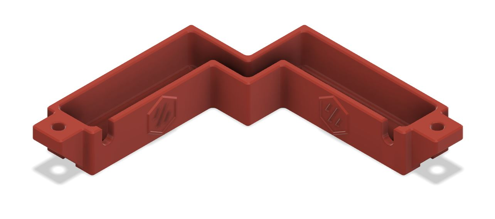

# Top Corner Cable Cover with Drop Down Holes (LED Wires)

This is originally based off of samwiseg0 mod 
https://github.com/VoronDesign/VoronUsers/tree/master/printer_mods/samwiseg0/corner_cable_hide

Modified LDO's PCB splitter spacer https://github.com/MotorDynamicsLab/LDOVoron2/blob/main/STLs/led_pcb_spacer.stl

Covers cables that are running around the top corners of 2.4R2 extrusions behind the Z idlers with drop down holes around the vertical extrusions and inline holes with cutouts to keep the wire management as clean as possible. Holes are big enough for a 3 pin microfit connector pass through any larger will require depinning.

**NEW** - Modified the existing design to all the LDO LED splitter PCB to be mounted on the back-upper 2020 extrusion. There's a cutout for the splitter PCB and spacer. This should allow you to use the max Z height of the stock LDO config.

**CAUTION** - Check your max Z travel as there may be some loss.

### Printing
  * Print 1 cover per LED strip
  * LDO - 1x cover with drop holes, 1x cover with drop holes PCB right and 1x spacer narrow.
  * Default voron settings
  * No supports needed

### BOM **(per cover)**
Size | Qty
--- | ---
M3x8 or 10 | 2
M3 T-Nut | 2

**Changelog**

Rev 02 - MINOR REVISION - Changed dimensions of cable cover with drop holes to prevent Z idlers from rubbing and reduced height to maximize Z height. 

Rev 01 - NEW - Created cable cover with a cutout section for the LDO LED PCB splitter due to limited Z height when PCB is installed on the Z 2020 extrusions. If following the recommended wiring path then use the one for right, but I also created a left version. You will have to use the my modified version of the LED Splitter Spacer since the LDO version is too wide. Use the same hardware used for the LDO version.
 

