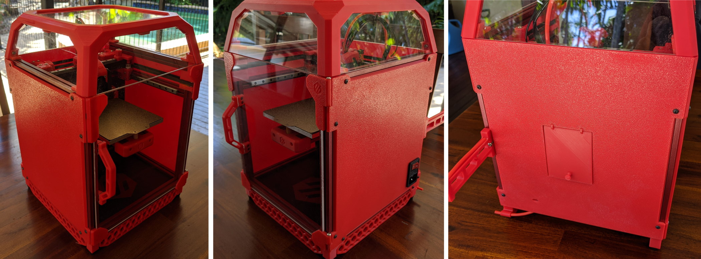

<div style="text-align: right"><sub>A Team Dropbear Production</sub></div>


# Voron Zero Printed Panels

G'day, Dr Ghetto here coming to you with money saving tips from down under. Too tight to buy acryllic? Too lazy to cut, saw or otherwise manually fabricate panels for your cute little Voron 0? Well you're in luck. This mod is a set of printed panels, _ghetto panels_ if you will. Buckle up bozos, deets to follow.

The right hand panel integrates the front door hinge mount. You don't need to print any corner pieces at all. A side panel is 248 x 237mm so  maybe you can print it on a 250. Do you feel lucky punk? The panels mount with two holes a side, so be sure to drop a nut from stock.

Word in the hood is you guys like it from the rear, so the back panel has a hatch to access the extruder. The stock spool holder fits with the back panel. If you printed the beta ```deck-panel-rear.stl``` then it blocks the ptfe tube. The Doctor shivved that sheet until it fit, because that's how we roll in the ghetto. Get yerself some hot ```foot-filament-guide.stl``` for a modded rear foot which grasps that sweet tube like Mrs Ghetto, know what I'm sayin'.



## Printing and plasic

Good to go with 0.6mm nozzle, 0.3 layer height. The panels print outside down. This works real nice on textured surfaces. If you're using a smooth surface, maybe you wanna use a nice top pattern, or no bottom layers for dat exposed infill look. Yeah baby.

Plastic? The ghetto abides. Always gonna be _that_ guy that prints it in PEEK but anything you can print without major warp is ghetto approved. After that, it's a bling thing. Show us what ya got!

## Alt parts

The mount holes are slotted to deal with ABS shrink but but shrink is bad for hinge alignment. Like duct tape on your AK, the ghetto has your back with remixes of the front right panel hinges ```panel_hinge_bottom.stl``` and ```panel_hinge_top.stl``` designed to fit standard ABS shrink. 

The right hand panel has two versions, ```panel_right_iec.stl``` has a cut-out for the commonly available\* switched and fused IEC power inlet, part number JR-101-1FRS. These are like eight bucks down under and they're officially ghetto approved. This part is for a 1mm (metal) panel so some silicone sealant is advised. As the hacker sage Naomi Wu once said, you can never have too much silicone. 

-DrGhetto (Calozor#1514)

<sub>\* In **Australia**. Hahahaaa `<cough>` You have no idea how much I've wanted to say that.</sub>
