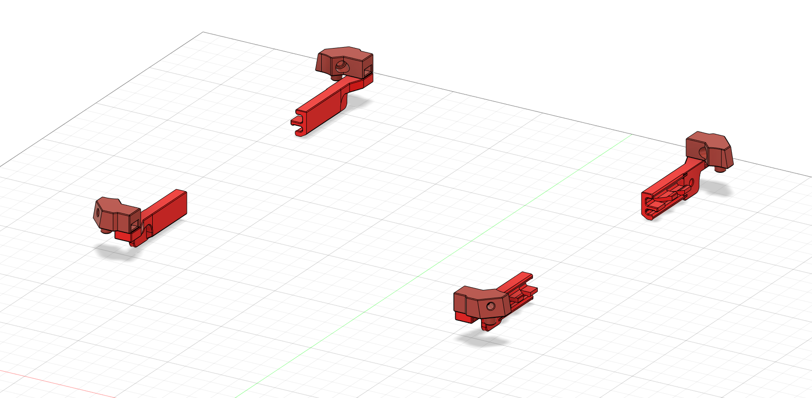

# Voron V0 Magnetic Tophat

This mod is a non intrusive no glue solution for a removable tophat on the v0. This is especially usefull for spaces without room for a hinged solution.
This also aligns the pegs with the existing holes in the corners of the frame. making it a good solution for hinged tophats that dont align well or do not remain closed when lowered.

BOM:
- 8x "6mm x 3mm Round Neodymium Magnets" (same as used in original BOM)

## Feedback

For feedback please message me on discord: Dreg#0212
