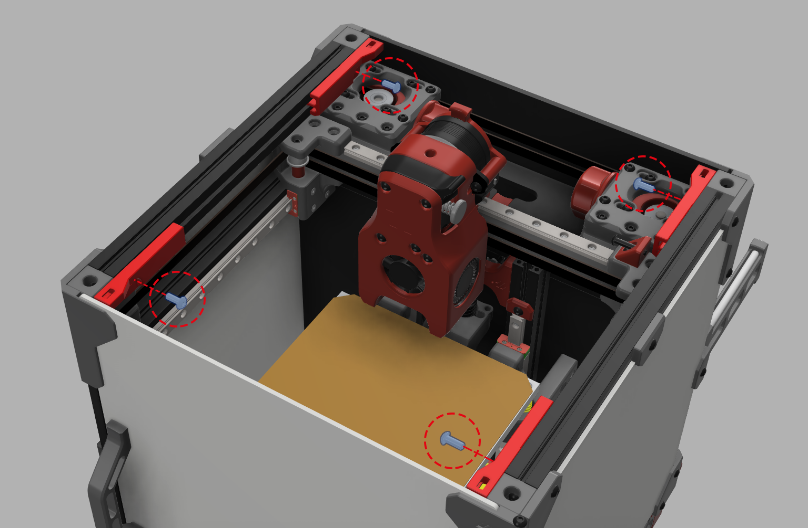
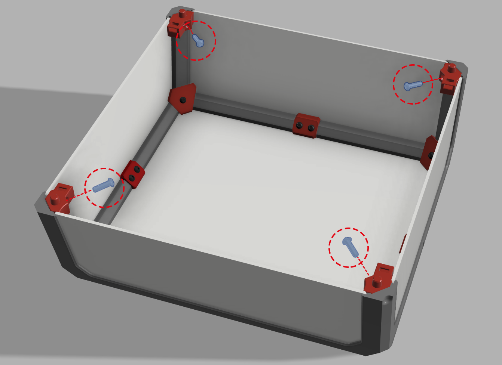

# Voron V0.1 Magnetic Tophat

This mod is a non intrusive, no glue solution for a removable tophat on the v0. This is especially usefull for spaces without room for a hinged solution.
This also aligns the pegs with the existing holes in the corners of the frame. making it a good solution for hinged tophats that dont align well or do not remain closed when lowered.
This mod is specifically made for the voron v0.1. Other versions might need modification before being compatible.

BOM:
- 8x "6mm x 3mm Round Neodymium Magnets" (same as used in original BOM)
- 4x M3x8 BHCS screw (same as used in original tophat assembly)
- 4x M3x12 BHCS screw (same as used in original tophat assembly)

## Assembly

Start off by inserting magnets in each corresponding 6mm hole. Orientation can be the same on each corner or alternating left and right according to preference.
Snap on the frame clips holding the magnets to the corners of the frame and screw them down with the m3x8 BHCS screws as seen in the image below.

Attach the tophat corner pieces the same way as is instructed on the voron v0 assembly manual. Screw the corners down with m3x12 BHCS screws as seen in the image below.

Now put the tophat on your printer and check if all corners align well and check if all magnets are aligned correctly. If assembled right you should see the tophat snap into place from a distance of about 1cm.

## Feedback

For feedback please message me on discord: Dreg#0212

## Credits

I would like to thank JosAr for the Klicky probe project. The Frame clips for this mod are derived from their clip design.
I would like to thank AdamV3D for the V0 Hinged Top Hat project. His tophat clip was the inspiration and basis on which i designed this mod.
