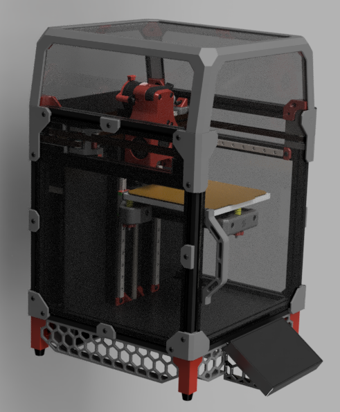

# Voron v0.1 4.3" Touchscreen Mount

This mod mounts a [Waveshare 4.3inch Capacitive Touch Display](https://www.waveshare.com/4.3inch-dsi-lcd.htm) purchased from [Amazon](https://www.amazon.de/gp/product/B08CH24YYD/ref=ppx_yo_dt_b_asin_title_o00_s00?ie=UTF8&psc=1).  The screen is oriented at a 55 degree angle

All needed STL inside, parts for the mount itself, modified Front-Skirts and extended Feet. All parts fit on the V0.1's printbed!

## Parts Required
| Part | Quantity | Comment|
|------|------|--------|
| M3 X 50 SHCS/BHCS Screw | 4 | for extended Feet |
| M3 X 6 SHCS/BHCS Screw | 6 | 4 from regular Skirts |
| M3 X 8 SHCS/BHCS Screw | 4 |  |
| M3 hex-Nut | 6 | 4 from regular Skirts |
| M3 Threaded Insert | 4 | standard Voron Specs |
| M2.5 Screws | 4 | Included with screen |
| DSI Cable | 1 | Long enough to reach your Pi |

## Printing
- Print using standard Voron part settings and in the orientation used in the STL
- No supports required
