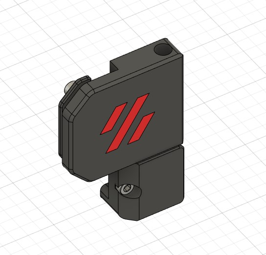
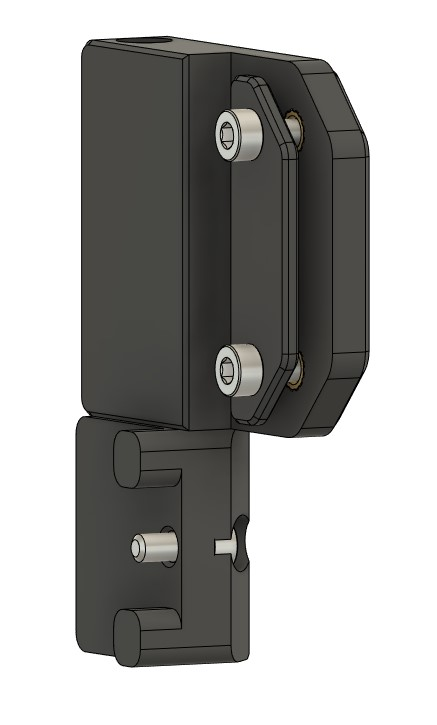
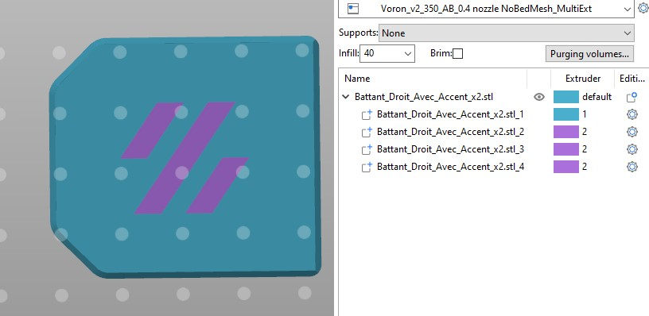

Removable door hinges

Axes are made with 4 M3x40

Front :

Back :

To print the logo in relief simply use the stl without accent.

To print the logo with your accent color in simulated MMU mode:
- open the stl in susie
- select the parts
- context menu 'Split-> To Parts'
- select the tool to print the different parts with the accent color

##########################################################################################
Charnières de porte démontable

Les axes sont réalisés avec 4 M3x40

Avant :

Arrière :

Pour imprimer le logo en relief utilisez simplement les stl sans accent.

Pour imprimer le logo avec votre couleur accent en mode MMU sumulé : 
- ouvrir le stl dans susie
- selectioner la pièce
- menu contextuel 'Split->To Parts'
- selectionner l'outil pour imprimer les différentes parties avec la couleur accent

