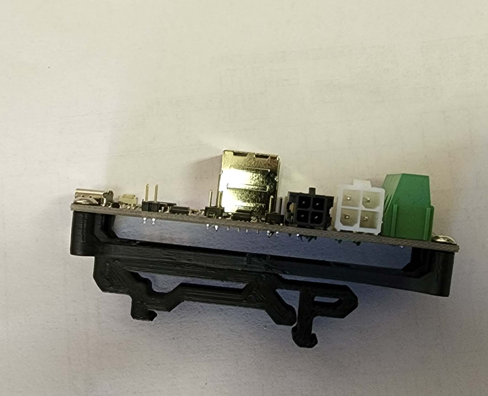

# Bigtreetech U2C Din Mount
Designed to mount the Bigtreetech U2C CAN Interface.

The model included can be mounted to the original 2.4 din clip or the newer Trident din clip.
For mounting on the V0 just use VHB tape and stick the bracket to the panel with the rest of the electronics

Based off the [NodeMCU Universal Mount](https://github.com/VoronDesign/VoronUsers/tree/master/printer_mods/samwiseg0/esp8266_nodemcu_din_mount) by samwiseg0 

### Printing
  * Default voron settings
  * No supports needed

### BOM

Size | Qty
--- | ---
M3x8 | 4
M2x10 | 2
[Trident PCB Din Clip](https://github.com/VoronDesign/Voron-Trident/blob/f871f117cdf2a3b3881c3bc176f0a8eb04e42057/STLs/ElectronicsBay/pcb_din_clip_v2_x5.stl) | 1

