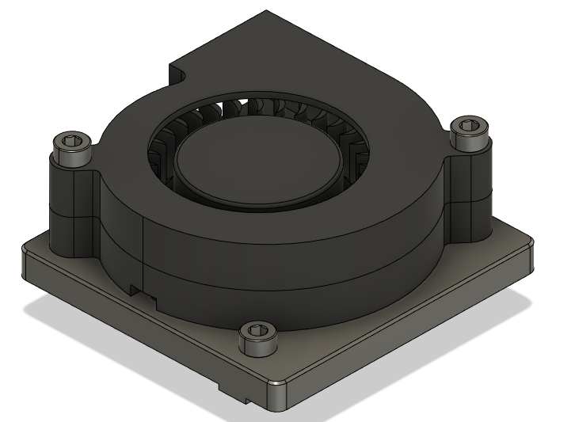
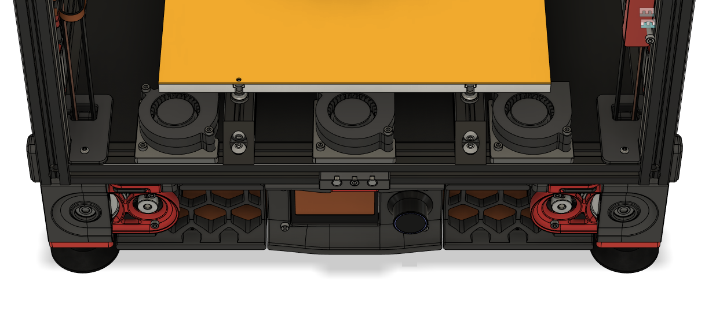
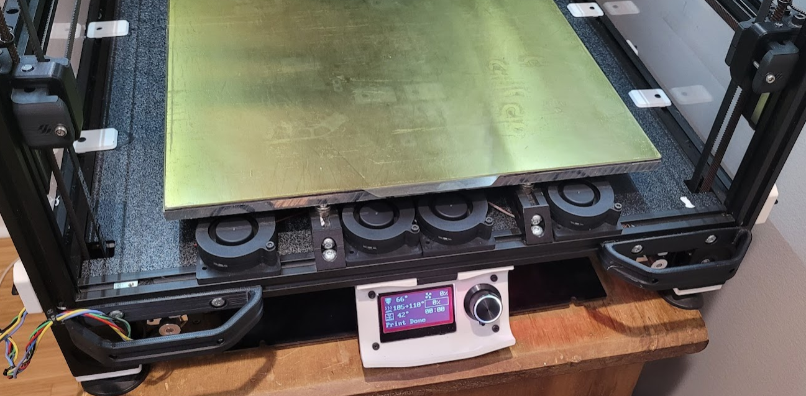

## Information
I created these macros because none of Klipper's fan control options (like `[temperature_fan]`) did quite what I wanted.

These macros are automatically invoked when your target bed temp is changed (and ONLY then). Because of this, you do not need to add anything to your other macros.

They have a pretty simple behavior. All they do is:
- Automatically set the bed fans to `variable_slow` speed while the bed is heating up.
- Automatically set the bed fans to `variable_fast` speed once target bed temp is reached.
- Automatically turn off the bed fans when the bed is turned off. 

These macros do NOT read the chamber temperature. If your chamber is getting too hot, simply lower the fan speeds.

If the above is not the behavior you desire, you have some other options: 
- Configure your bed fans as `[fan_generic]` and control them manually with `SET_FAN_SPEED` in your `PRINT_START`/`PRINT_END` etc.
- Use one of Klipper's other fan control methods like `[temperature_fan]`.
- Modify these macros to achieve your desired custom behavior (or write new ones).
## **Setup**

**Please see the ["Information"](#information) section first.**

**1)** Place the .cfg file (located in the [Klipper_Macros](./Klipper_Macros) folder) in the same directory as your printer.cfg file. 

**2)** Add `[include bedfans.cfg]` to your printer.cfg.

**3)** Change `pin` for your fans in the second section. 
- This is intentionally left blank so that it will error if you don't fill it in.

**4)** Configure the options in the first section:

- `variable_threshold` sets the bed temp threshold at which your bed fans will be used. 
    - Default is 100C (so it does not enable for PLA)
- `variable_slow` sets the fan speed for when the bed is **heating.** 
- `variable_fast` sets the fan speed for when the bed is **at temperature.**

### Tips
- `bedfans-dualcontrol.cfg` optionally allows for setting inner and outer fan speeds separately, for a quad fan configuration.
- If you get *"Heater heater_bed not heating at expected rate"* errors, then you have one or both of your fan speeds set too high.
- `variable_slow` can be set to 0 if you prefer the fans to remain off during heatup.
## **5015 Fan Mount**

Bill of materials (per fan):
- 1x 5015 fan
- 1x M3x25
- 1x M3x20
- 1x M3 heat set insert
- 1x M3x8 or M3x10 *(optional, I only mount with one screw)*

  

## **FAQ**

#### How much difference does it make?
* My chamber now reaches about 60-66C with a quad fan configuration, whereas it only reached roughly 48-50C previously. Chamber temp is also reached more quickly.

#### Can I push it further?

* Technically your bed heater is not being run at full power with the default configs, however I *do not recommend pushing it.* Since you can't control max power at runtime, your bed will run at too high of a power while heating, risking warping your bed. 

* *I also do not recommend tinkering with your verify_heater (thermal runaway protection) settings.*

#### What power should I run my bed heater at?

* Recommended max_power is 0.4 watts per cm<sup>2</sup>:

```
For example, for a 300 mm^2 bed:

30 cm * 30 cm = 900 cm^2.
900 cm^2 * 0.4 Watts = 360 Watts max.
If you have a 750 watt heater, that's 48% power, or 0.48 max_power.
```


#### Do I need to PID tune my bed again?

* I did not find it necessary. Bed heaters do not seem to be terribly sensitive to this. 

#### My bed temperature dips when the fans kick on fully, is this normal?

* Yes, this is normal. It should recover within 60 seconds. If not, then your fan speeds are too high.

#### What brand fans should I use?

* I just used generic multi-pack fans. There is no need for anything fancy here.

#### Should I use single, dual or triple/quad fans?

* Triple/quad fans is more for *even* airflow than *raw* airflow. In fact you will likely not be able to run them at 100% without outrunning your bed heater. I personally prefer triple/quad fans to avoid any possibility of "tacoing" my bed due to uneven temperatures. Triple fans is probably the "sweet spot".

#### Is "dual control" necessary?

* Almost certainly not. I originally set it up that way because it was easier to wire in my particular case, so I took advantage of it. Triple fans with "single" control is probably the best balance of cost, complexity, and performance.

#### I insist on running quad fans at 100%, why am I having a bad time?

* No. Stop it. Bad.
## **Images**

*(looks a bit tight since CAD is for a 250mm)*

  
  