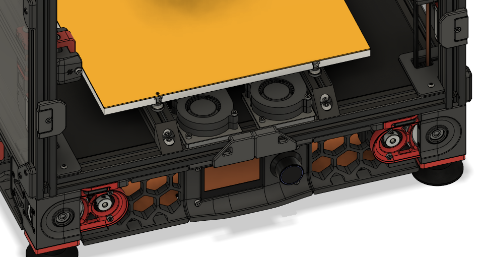
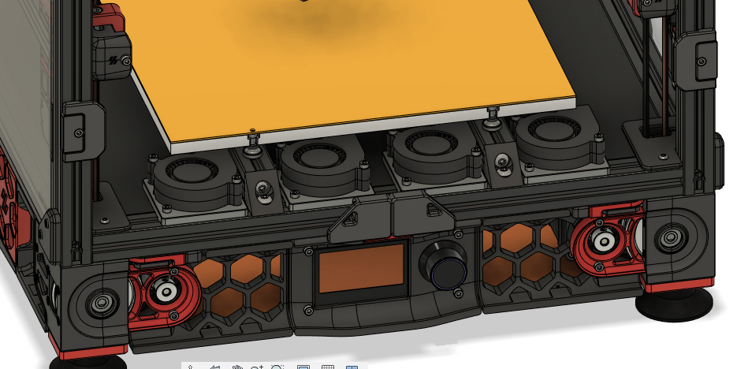

## <B>Macros</B>

See <B>bedfans.cfg</B> for klipper macros.

The macros will intercept bed heating commands, so you do <I>not</I> need to add anything to your other macros. 

* <B>variable_threshold</B> sets the target bed temperature at which your bed fans will activate.
* <B>variable_slow</B> sets the fan speed for when the bed is heating to the target temp.
* <B>variable_fast</B> sets the fan speed for when the bed is at temperature.

Don't forget to change the pin(s) for your fans.

\*<I>bedfans-dualcontrol.cfg allows separate control for inner and outer bed fans in a quad fan configuration. 
I like to set a slightly lower speed for the inner fans.</I>

## <B>5015 Fan Mount</B>

Bill of materials:
- 1x 5015 fan
- 1x M3x25
- 1x M3x20
- 1x M3x8 or M3x10
- 1x M3 Threaded Insert

  

  

  
(a bit tight since CAD is for a 250mm)