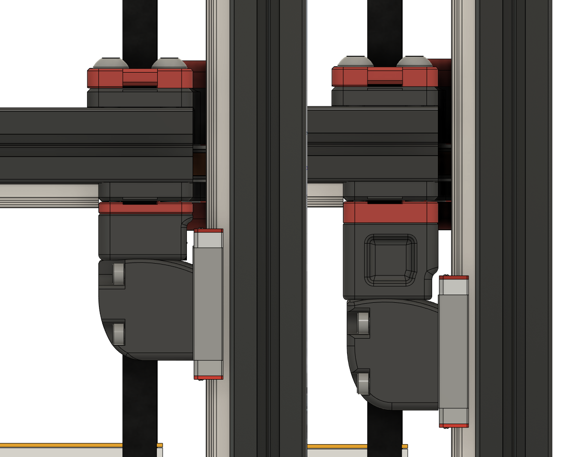
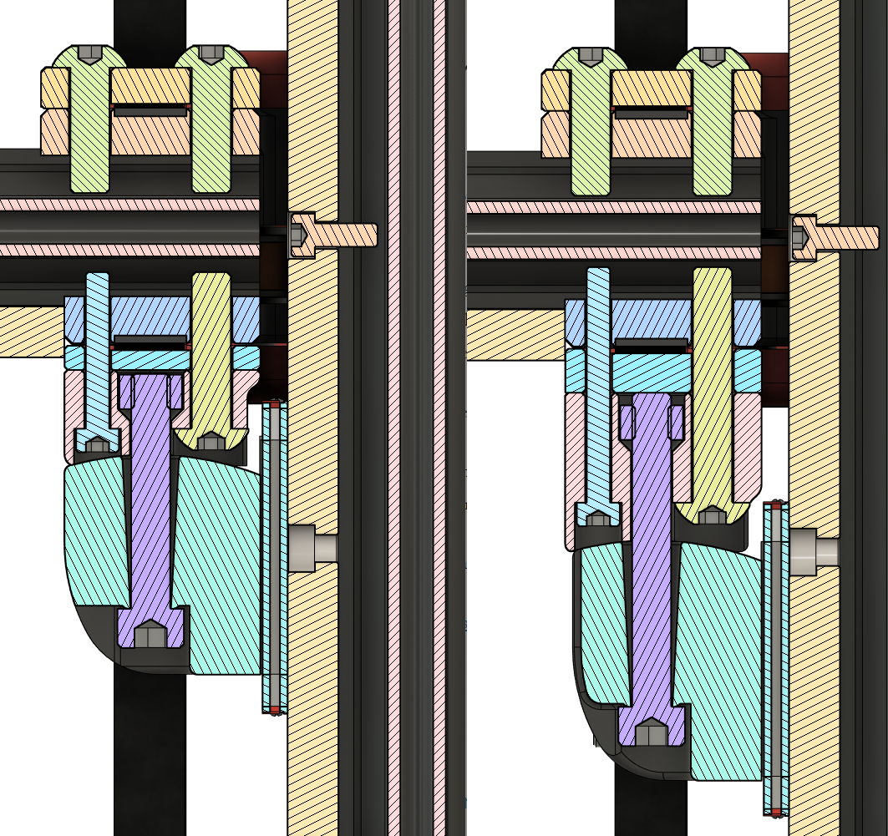

# Shorter Z joints for Voron 2.4

**:warning: This mod was made before the [GE5C mod](https://github.com/hartk1213/MISC/tree/main/Voron%20Mods/Voron%202/2.4/Voron2.4_GE5C). I'd generally recommend using that mod instead nowadays.** 

- I'm keeping this mod around as an alternative doesn't require purchasing bearings.

## Info
This mod reduces the size of the Z joint stack by 12.5mm.

The intent is to increase gantry stability by reducing the leverage exerted on the joints.

This is only tested with microswitch XY endstops. There is no hall effect magnet slot, though you may be able to affix one to the upper right screw head.

To use this mod, you will need:
- 4x M5x30 SHCS/BHCS
- 4x M5x20 BHCS
- 4x M3x20 SHCS
- 4x M5 nylon lock nuts *(optional*)*
    - *You can use standard M5 nuts as per the original config, however I prefer nylock nuts here.*

## Images
**Side by Side (stock joint on right)**

**Cross Section (stock joint on right)**

