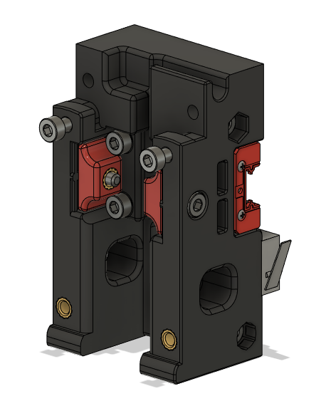
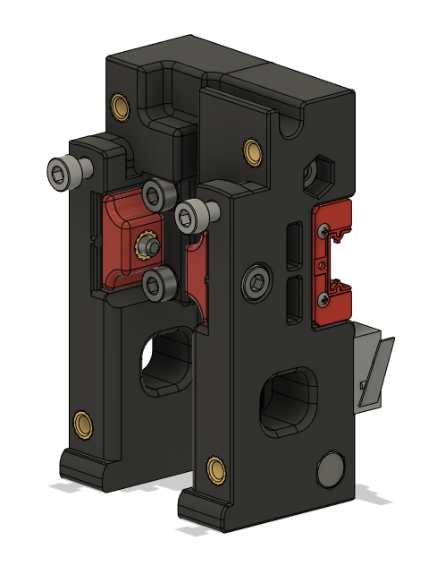
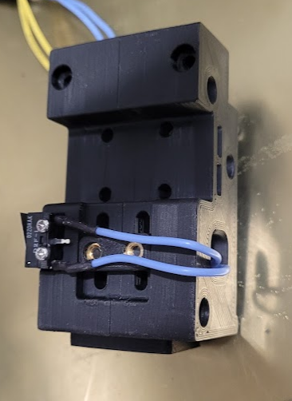

# Single MGN9H Carriage

This mod removes the second MGN9H mount and adds support for an optional toolhead X endstop (to allow for umbilical).

Make sure your switch lever is in the orientation shown to ensure it triggers properly against the XY joint.

Supports V2.4 and V2.4r2. Likely works with Trident also.

You will need the belt clamps and probe retainer brackets from the [v2.4r1 release](https://github.com/VoronDesign/Voron-2/tree/5ebe725ef6435274c22f2442686cdbfd98a2b59c/STLs/VORON2.4/Gantry/X_Axis/X_Carriage), as MGN9 files are no longer included in the r2 release.

## Images
### CW1

### CW2

### Built
  