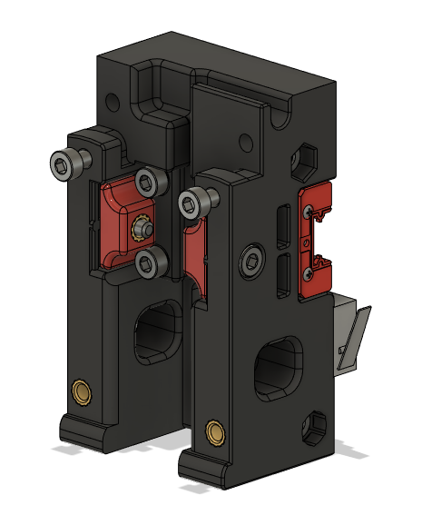
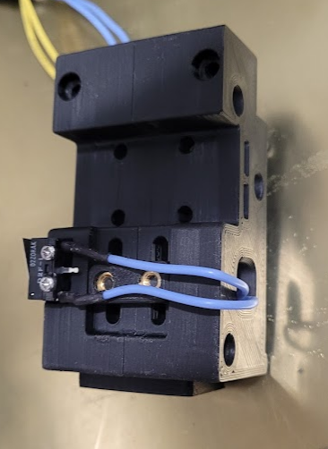

## <B>Single MGN9H Carriage</B>

Modified carriage to:
* Remove the second MGN9 mount
* Add optional toolhead X endstop (to allow for umbilical)

Make sure your switch lever is in the orientation shown to ensure it triggers properly against the XY joint.

  