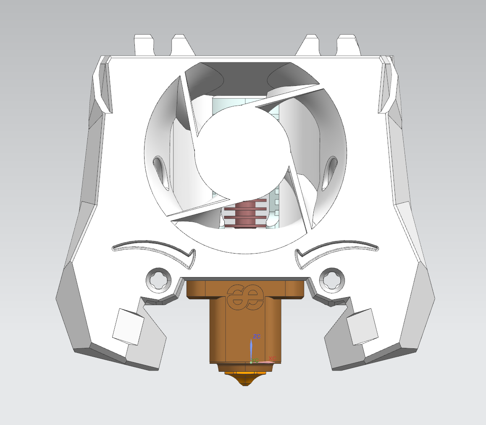

Stealthburner (RC1) Phaetus Dragon UHF and Phaetus Dragon UHF mini Fan Duct
===
With special thanks to @eamers for the Crazy dragon heatblock, as well as @bythorsthunder for the Stealthburner Rapido UHF body design the awesome base design from the VoronDesign team! 

For the regular Dragon UHF hotend with the extended melt zone, use the `SB_Dragon_UHF_TH_*.stl` and the enlarged main body `Stealthburner_Body_Dragon_UHF.stl`.
Parts were extended by 8.3mm to fit the Stealthburner Rapido UHF main body by @bythorsthunder.

If your use the Dragon UHF mini hotend (standard UHF version without the melt zone extender), use `SB_Dragon_UHF_TH_mini_*.stl` and the regular Stealthburner body.

The fan duct is designed based on the Crazy Dragon Fan Duct, allowing air to only blow towards the heatbreak.
A channel for the thermistor cables was added to allow mounting the hotend in the proper direction facing forward.

Print Parameters
---
Print in standard Voron settings. 

Previews
---

