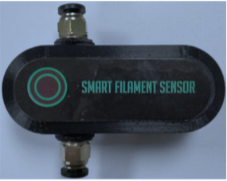
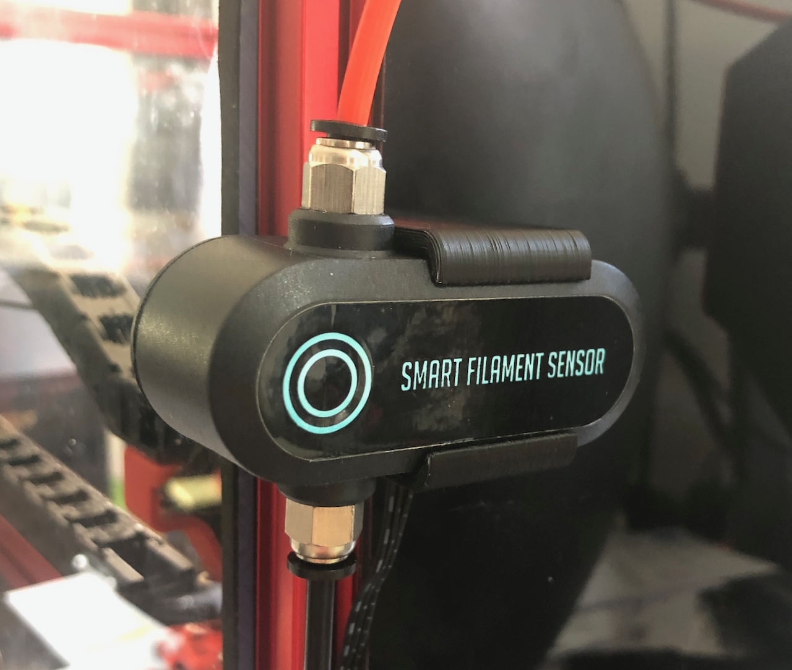
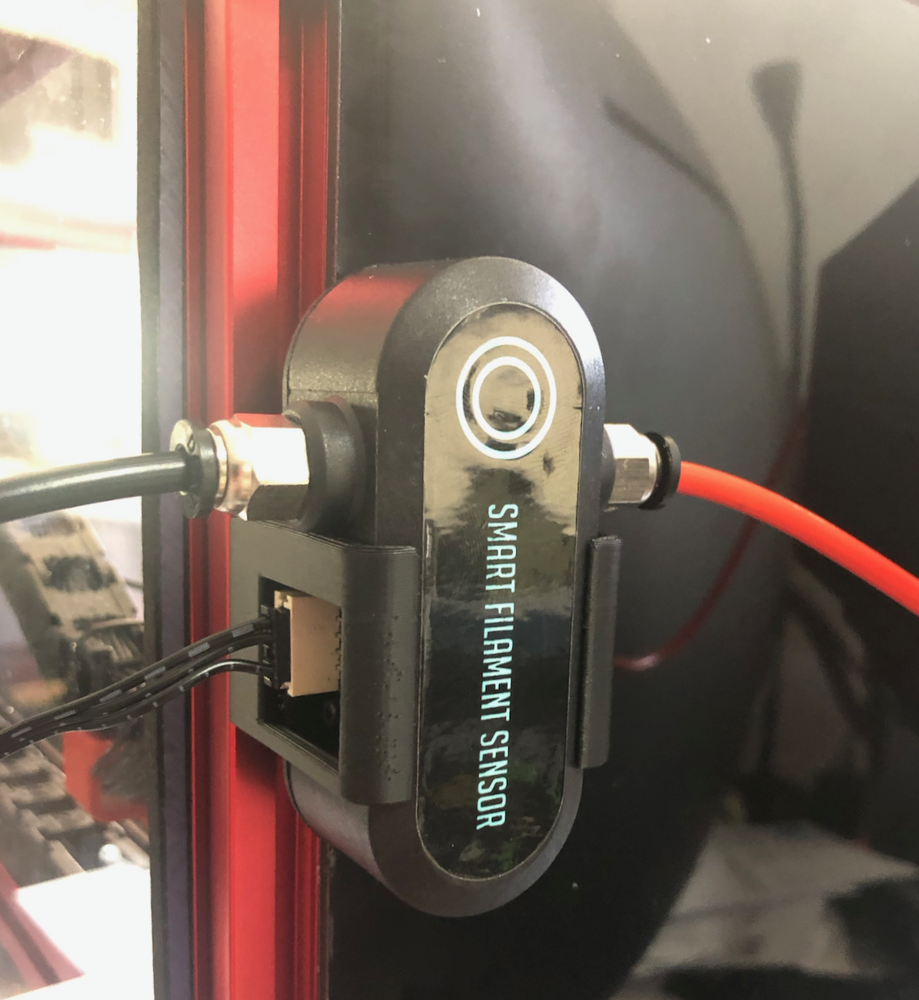
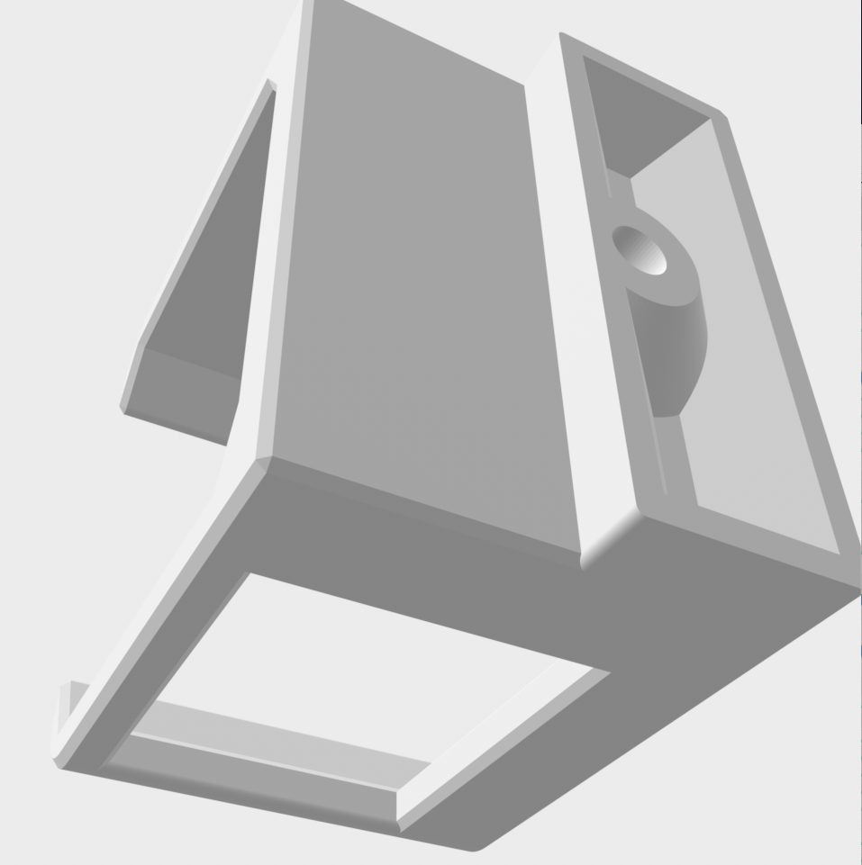
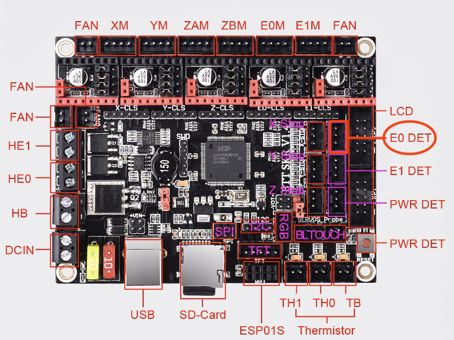
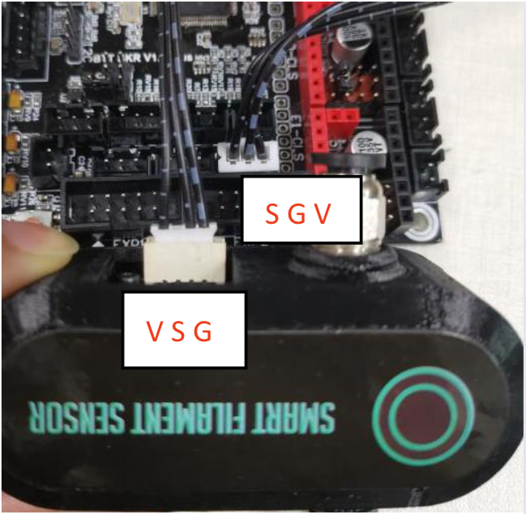

# BTT Smart Filament Motion Sensor mounts

### Overview
I always liked the motion sensor on my original Prusa MK3 and was very disappointed when they switched to a mechanical solution that cannot detect motion on the MK3S.
So I was pleased to see that Big Tree Tech picked up the idea and even improved the reliability. The MK3 had an optical sensor that tried to detect the filament itself which caused some issues with some type/colour of filament. In the BTT sensor the filament drives a wheel that is then detected by an optical sensor.
I did not want to add more weight to my x-carriage, so I designed the mount for the extrusion profiles, outside the printer housing.



### Description
These mounts fit for the BTT Smart Filament Motion Sensor. You can also use two of the housing screws and I have seen other mounts that replace the back of the housing, but I wanted something that is easy to remove, if I have to. You just have to unplug the cable and then the sensor snaps into the mount. To unmount unplug the cable first.
I have created two version to mount the part vertically or horizontally.







The installation with BTT SKR boards is easy. The connector already fits to the board connector like the E0 DET.


S=Signal, G=Ground(-) and V=Voltage(+3.3-5V)



The next step is to configure Klipper. If you use the E0 DET connector then the pin is P1.26 (or xP1.26 if you connected to the x board).
It is documented here -> [klipper Config_Reference](https://www.klipper3d.org/Config_Reference.html#filament_motion_sensor)
Open your printer.cfg and add the section, then adjust the config as in the example below. You can use your own name for the sensor, I used "btt_sensor".
I added this section right above the Marco section.
```printer.cfg
[filament_motion_sensor btt_sensor]
detection_length: 7.0
#   The minimum length of filament pulled through the sensor to trigger
#   a state change on the switch_pin
#   Default is 7 mm.
extruder: extruder
#   The name of the extruder section this sensor is associated with.
#   This parameter must be provided.
switch_pin: P1.26
#   The pin on which the switch is connected. This parameter must be
#   provided.
pause_on_runout: True
#   When set to True, a PAUSE will execute immediately after a runout
#   is detected. Note that if pause_on_runout is False and the
#   runout_gcode is omitted then runout detection is disabled. Default
#   is True.
runout_gcode:
    M117 Filament out
#   A list of G-Code commands to execute after a filament runout is
#   detected. See docs/Command_Templates.md for G-Code format. If
#   pause_on_runout is set to True this G-Code will run after the
#   PAUSE is complete. The default is not to run any G-Code commands.
#insert_gcode:
#   A list of G-Code commands to execute after a filament insert is
#   detected. See docs/Command_Templates.md for G-Code format. The
#   default is not to run any G-Code commands, which disables insert
#   detection.
#event_delay: 3.0
#   The minimum amount of time in seconds to delay between events.
#   Events triggered during this time period will be silently
#   ignored. The default is 3 seconds.
#pause_delay: 0.5
#   The amount of time to delay, in seconds, between the pause command
#   dispatch and execution of the runout_gcode. It may be useful to
#   increase this delay if OctoPrint exhibits strange pause behavior.
#   Default is 0.5 seconds.
```

For the next section I have to mention that the filament motion sensor is working in klipper, but the get_status() method is missing and hence the printer.endpoints don´t work.
There is an [open issue](https://github.com/KevinOConnor/klipper/issues/4126) that is not yet resolved.
Until this is resolved you cannot use the LCD to turn on/off the sensor nor will have a widget in the Mainsail dashbord.
But you can still use it while printing.

For every 7mm the BTT sensor will give a signal to the board. Klipper will compare the value for the extruder with the filament sensor.
So klipper will only report missing filament when the extruder is running. Keep this in mind while testing.

You can check the status on the console with the command:

```console
QUERY_FILAMENT_SENSOR SENSOR=btt_sensor
```
You can switch the filament sensor off via console command
```console
SET_FILAMENT_SENSOR SENSOR=btt_sensor ENABLE=0
```
and back on with
```console
SET_FILAMENT_SENSOR SENSOR=btt_sensor ENABLE=1
```
But it would be cool to set the switch the sensor on/off in the LCD right? Well alexz V2.660 has done that already and published his config/code here [alexz GitHub](https://github.com/zellneralex/klipper_config/blob/master/runout.cfg#L89).
So I used his code and changed it a bit to fit my needs.
```LCD Menu section
#####################################################################
# 	LCD Menu
#####################################################################   

[menu __main __control __runoutonoff]
type: input
enable: {'filament_motion_sensor btt_sensor' in printer.configfile.settings}
name: Runout: {'ON ' if menu.input else 'OFF'}
input: 1
input_min: 0
input_max: 1
input_step: 1
index: 4
gcode:
  SET_FILAMENT_SENSOR SENSOR=btt_sensor ENABLE={menu.input|int}
```


```Macro section
#####################################################################
# 	Macro
#####################################################################
[gcode_macro _RUNOUT_INFO]
gcode:
  
    #
    #
    
    
    {action_respond_info("RUNOUT Motion Sensor:
                          Enabled: %s
                          Detect Filament: %s" % (enable|lower,detect|lower))}
  


```
