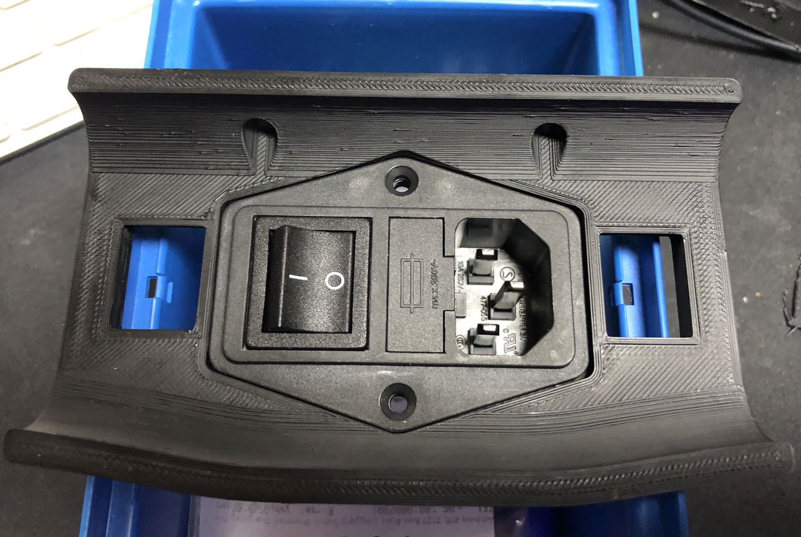

# Voron 2.x Skirt Mod for Schaffner FN284-10-06

### Overview
Voron 2.x skirt mod for the Schaffner FN284-10-06 power entry module with fuse and filter. 

### Description
This is an mod for the Voron 2.x skirt 
* You can use two M3 countersunk screws with nuts to mount it on the skirt 

I liked the mod from DC67, but could not find the Schaffner FN286-10-06 for a reasonable price. So I designed one for the Schaffner FN284-10-06.

