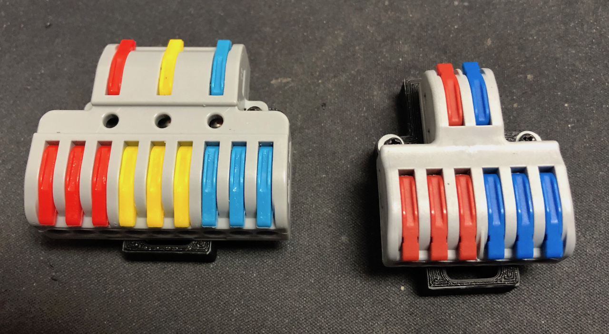
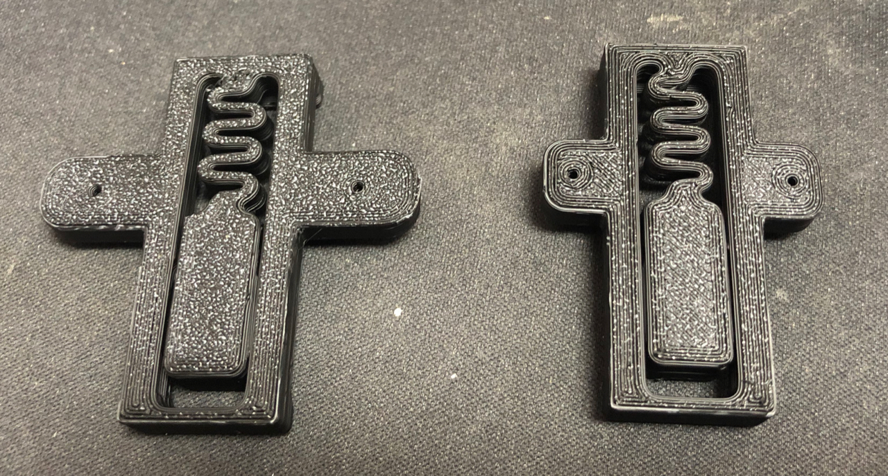
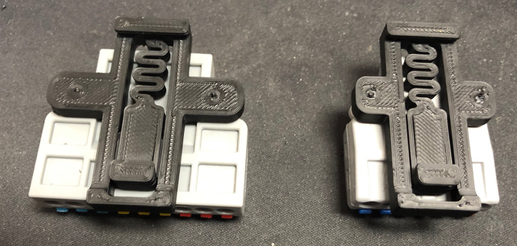

# Mounts for Power Terminals from AliExpress

### Overview
I found those no-name power terminals on AliExpress and found them useful to distribute the power in the Voron.
So I designed a mixup from the PSU DIN rail mounts for them.
!! Use them at your own risk like any other electrical part in your printer. !!

### Description
These mounts fit for the SPL-62 and NC-933 1to3 power terminals that can be found at Electrician Electrical Store on AliExpress.
I do like the compact design over the WAGO or Phoenix Contact terminals. They do have a strong clamping force, but I would not trust in the sellers specifications of 32 Amps. For the use in a Voron they should be fine.

NC-933 (https://de.aliexpress.com/item/4001236902340.html)
SPL-62 (https://de.aliexpress.com/item/4000505115328.html)

* You can use two M2 self tapping screws to mount them
* I recommend a stack of washers or a 3D printed spacer for the SPL-62 as the mount holes are not flat on the backside.

Again, use them at your own risk. You should not work on mains voltage if don't know you're doing.
And your printer should be properly protected by fuses, circuit breakers or even a ground fault circuit interrupter.
If you have any concerns, don't use them, get genuine WAGO/Phoenix Contact instead!

