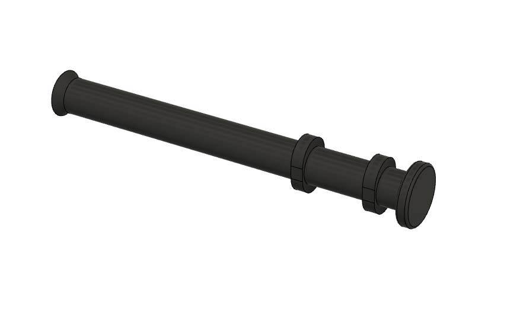
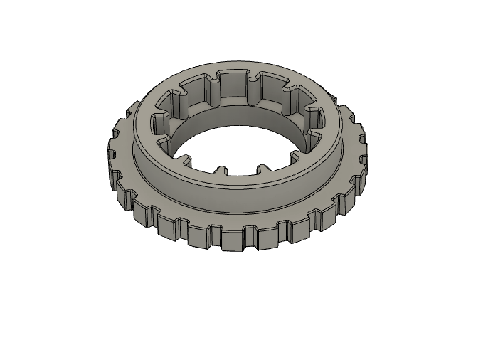

# C270 mount #

Top-front mount for a Logitech C270 camera, based on https://github.com/VoronDesign/VoronUsers/tree/master/printer_mods/Koios/C920_Mount

The mount uses the pin and screw from the stock camera's arm, and the front of the camera is removed in order to use the focusing ring.

Fiction#5826 on Discord
