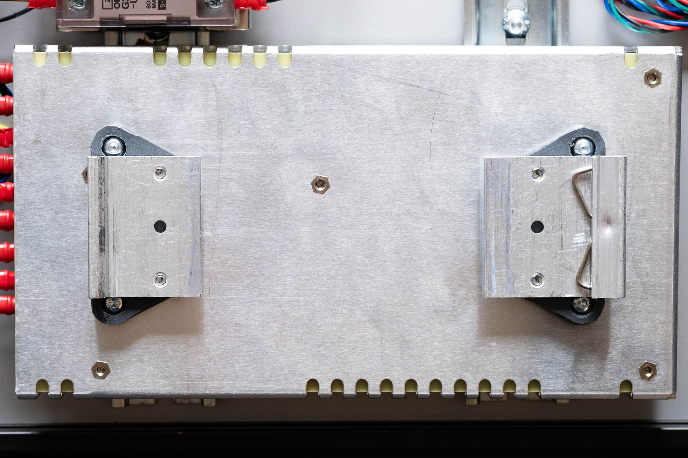
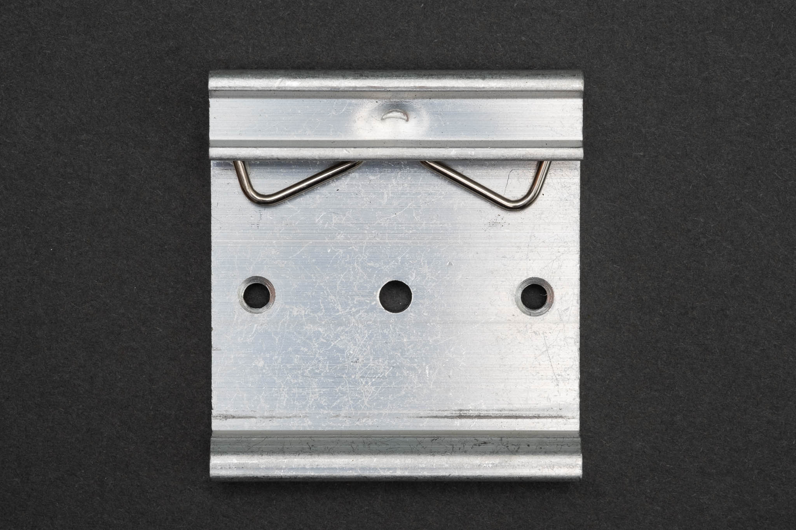
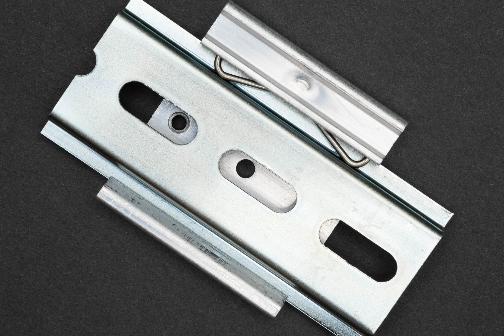
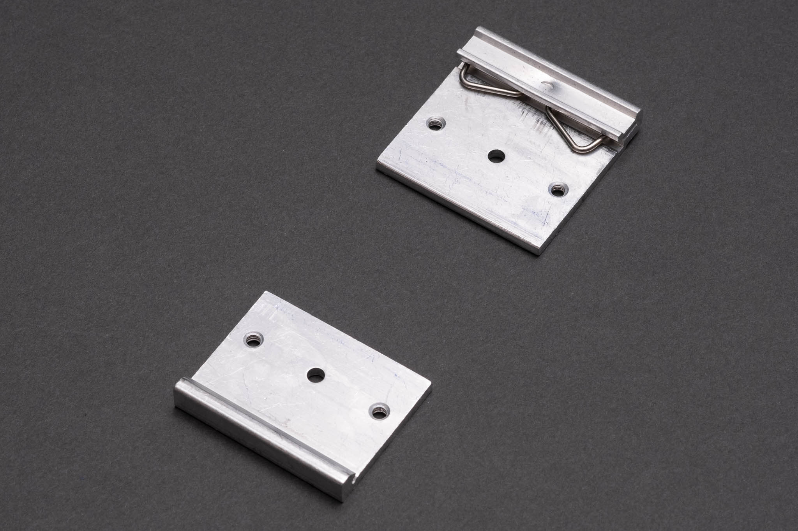
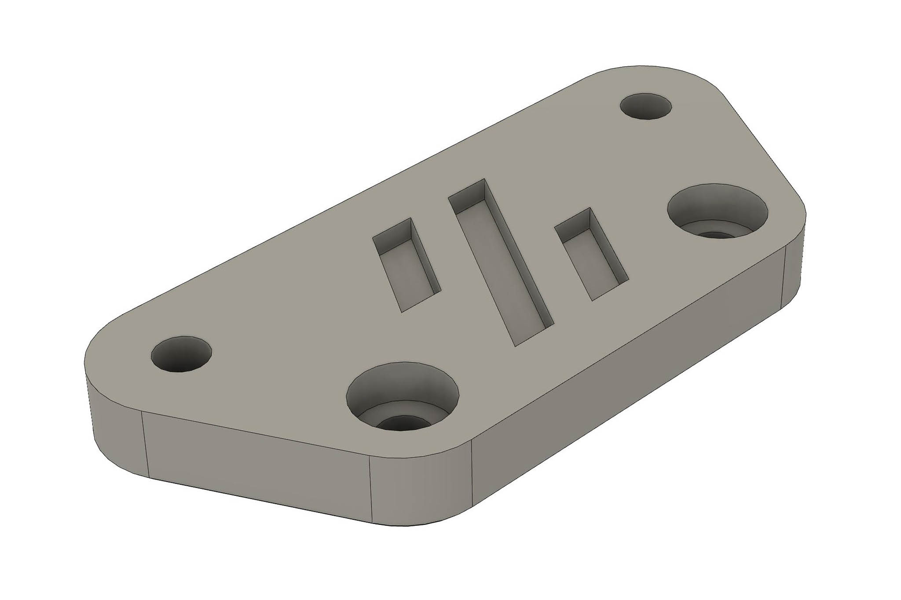
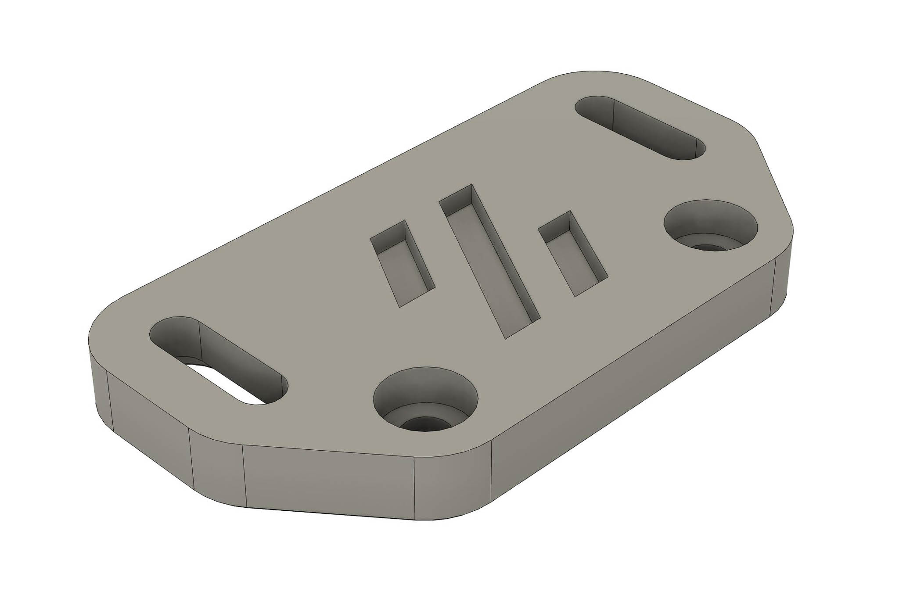
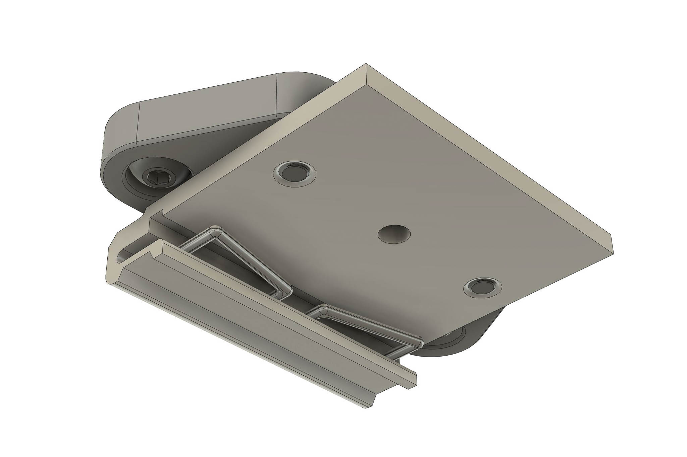
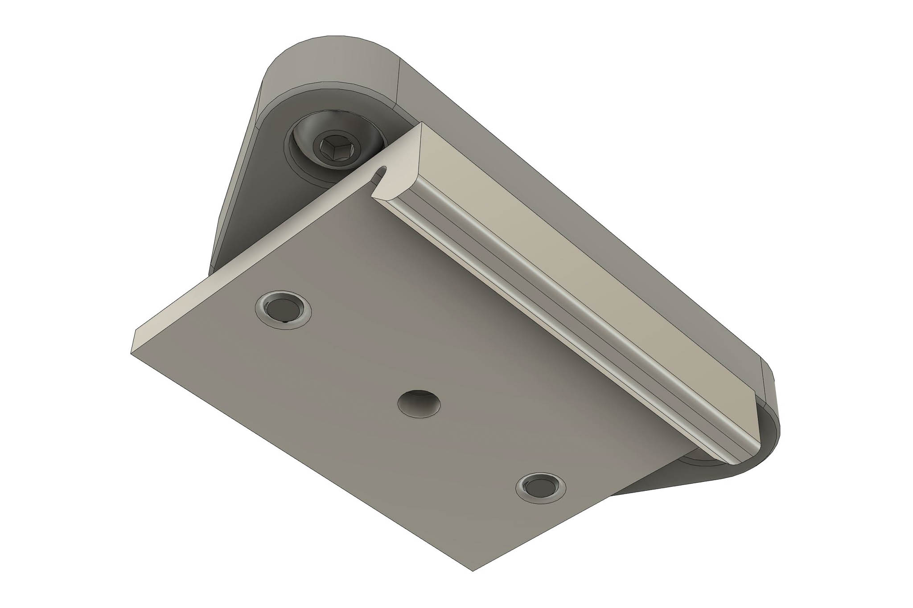
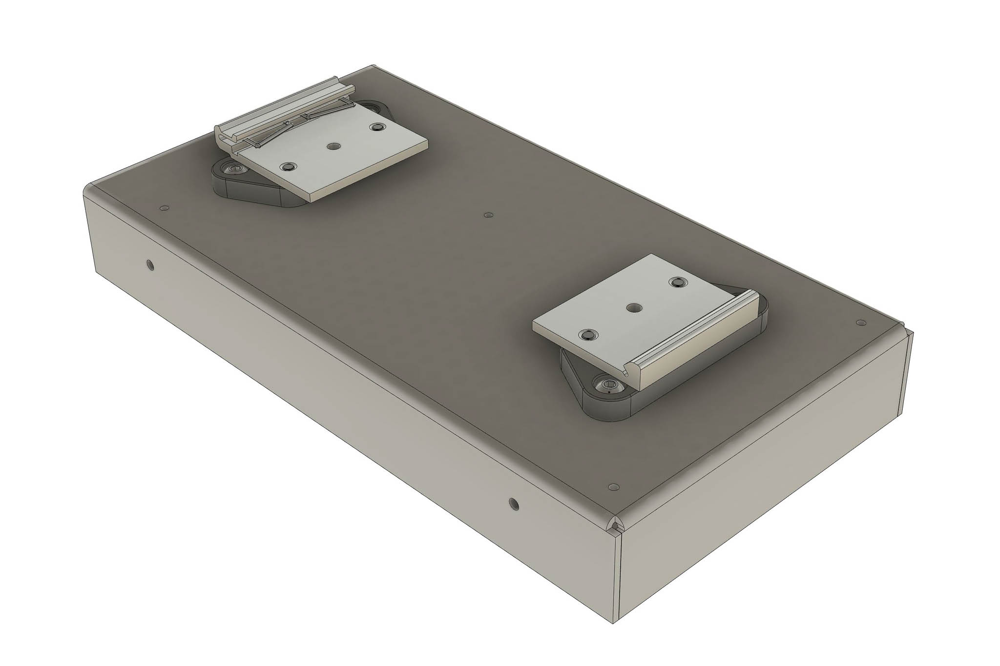

# Crossrail

~~Crossrail is a railway construction project underway mainly in central London. Its aim is to provide...~~

Crossrail is a printed adapter for RSP-200-24 or LRP-200-24 power supplies and DRP-03 brackets. It allows the power supply to be mounted securely across the rails (or vertically as it's sometimes called).

The alternate part *crossrail_slot* is the same mount but with slots to allow 10mm adjustment in either direction

## Bill of materials
 - 2 x DRP-03 DIN rail power supply plate (Mouser, Digikey, Time, Ebay, powersuppliesonline.co.uk etc). These need to be cut to create one fixed end and one sprung end. I used a chop saw but a hacksaw or grinder would work too. File or deburr the cut edges if needed.
 - 8 x M4x6 socket button head screws
 - 2 x crossrail.stl or crossrail_slot.stl (or one of each)

## Notes
For *crossrail.stl* the DIN rails need to be spaced 120mm apart centre-to-centre (that's a 85mm gap for 35mm rails).  *crossrail_slot.stl* has 10mm adjustment in either direction to allow for different rail spacing (although the rails should still be parallel).

## Images
### DRP-03 before cutting and in normal use

### 2 x DRP-03 after cutting

### crossrail.stl

### crossrail_slot.stl

### Insert 2 M4x6 screws for power supply and fix to DRP-03

### Same for the other DRP-03

### Screw to the power supply

